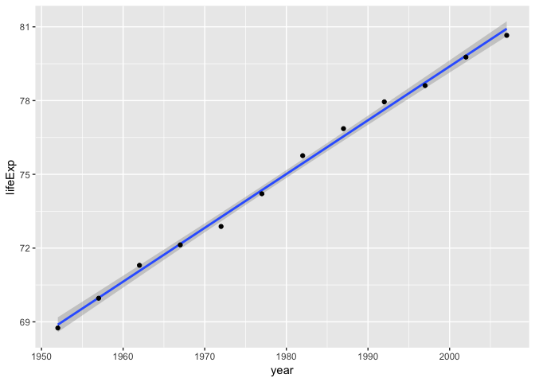
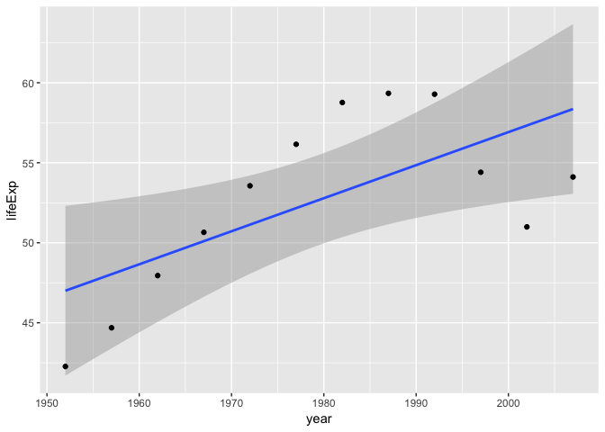
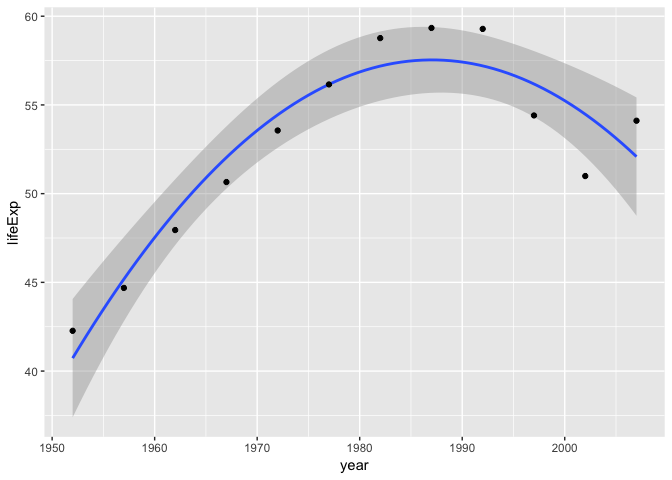
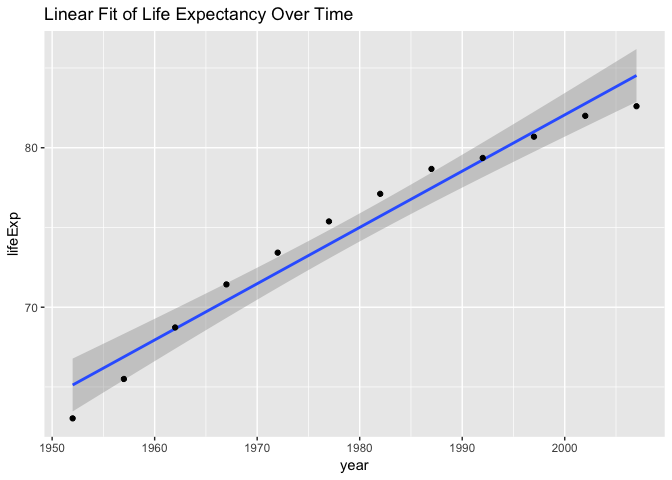
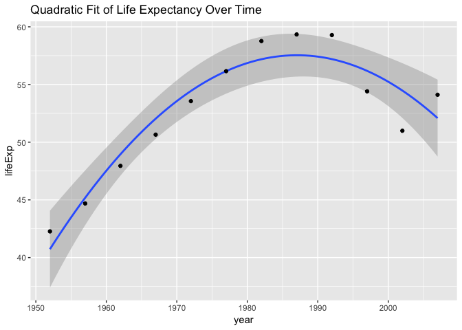
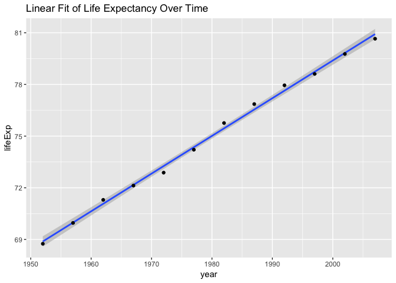

STAT547\_hw06\_JasmineLib
================

Jasmine's STAT 547 Homework 06
==============================

Sections tackled:

Option 1 Working with Character Data - Completed the Exercises from Strings chapter in R for Data Science

-   provide solutions to the exercises, to serve as an example and reference point for future work and assignments.
-   create relevant "test vectors" and examples to improve understanding.

Option 2 Writing functions:

-   worked through the exercise on a linear regression function customized for gapminder data ()
-   as part of this assignment, made a function to perform a quadratic regression on gapminder data.
-   also made functions for simple visualization of regression line data on a basic ggplot.

``` r
library(tidyverse)
```

    ## ── Attaching packages ─────────────────────────────────────── tidyverse 1.2.1 ──

    ## ✔ ggplot2 3.0.0     ✔ purrr   0.2.5
    ## ✔ tibble  1.4.2     ✔ dplyr   0.7.7
    ## ✔ tidyr   0.8.1     ✔ stringr 1.3.1
    ## ✔ readr   1.1.1     ✔ forcats 0.3.0

    ## ── Conflicts ────────────────────────────────────────── tidyverse_conflicts() ──
    ## ✖ dplyr::filter() masks stats::filter()
    ## ✖ dplyr::lag()    masks stats::lag()

``` r
library(stringr)
```

Part 1: Exercises in R for Data Science Strings Chapter:
--------------------------------------------------------

here I work through all the exercises from the Strings Chapter. in the [R for Data Science Textbook](https://r4ds.had.co.nz/strings.html).

### 14.2 String basics

What is difference between paste() and paste0() and what is the equivalent stringr function?

How do they differ in their handling of NA?
- using paste or paste0 , the NA will get coerced into a character, then pasted.
- using str\_c, if there is an NA in either vector, it will return NA.

``` r
library(stringr)

test_vector1 = c("A", "B", NA, "C")
test_vector2 = c("D", "E", "F", NA)

#paste() will concatenate vectors using sep = " "
paste(test_vector1, test_vector2)
```

    ## [1] "A D"  "B E"  "NA F" "C NA"

``` r
#paste0() will concatenate vectors without any separation
paste0(test_vector1, test_vector2)
```

    ## [1] "AD"  "BE"  "NAF" "CNA"

``` r
#str_c is the equivalent stringr function. Here we specify the separation using sep. 
str_c(test_vector1, test_vector2, sep = " ")
```

    ## [1] "A D" "B E" NA    NA

In your own words, describe the difference between the sep and collapse arguments to str\_c().

``` r
# using collapse will combine ALL entries within a vector, separated by ", " in this case. Using Sep will separate the two components being combined. 
str_c(letters, LETTERS, collapse = ", " )
```

    ## [1] "aA, bB, cC, dD, eE, fF, gG, hH, iI, jJ, kK, lL, mM, nN, oO, pP, qQ, rR, sS, tT, uU, vV, wW, xX, yY, zZ"

``` r
str_c(letters, LETTERS, sep = ", " )
```

    ##  [1] "a, A" "b, B" "c, C" "d, D" "e, E" "f, F" "g, G" "h, H" "i, I" "j, J"
    ## [11] "k, K" "l, L" "m, M" "n, N" "o, O" "p, P" "q, Q" "r, R" "s, S" "t, T"
    ## [21] "u, U" "v, V" "w, W" "x, X" "y, Y" "z, Z"

Use str\_length() and str\_sub() to extract the middle character from a string.

``` r
#check length of a string:
str_length("teststring")
```

    ## [1] 10

``` r
#for even numbers I chose to return a substring composed of the 5th and 6th (middle characters) of the string
str_sub("teststring", 5,6)
```

    ## [1] "st"

``` r
#what does str_wrap( ) do?
#str wrap helps "wrap" strings into paragraphs, where width is how many characters can fit on one line, and indent/exdent determines the indentations within the paragraph. this would be useful for times when you want to display paragraphs.

str_wrap("teststring, string, testing", width = 10, indent = 6, exdent = 5)
```

    ## [1] "      teststring,\n     string,\n     testing"

``` r
#what does str_trim() do? 

#removes whitespace at start and end of string.
#opposite of str_trim is str_pad()
str_trim("     teststring, string, testing     ")
```

    ## [1] "teststring, string, testing"

Write a function that turns (e.g.) a vector c("a", "b", "c") into the string a, b, and c. Think carefully about what it should do if given a vector of length 0, 1, or 2.

``` r
test_vector_3 = c("1", "2")

vector_to_string = function(x) {
  to_return = "vector input invalid"
  if (length(x) == 0) to_return
  else if (length(x) == 1) to_return = str_c(x[1])
  else if (length(x) == 2) to_return = str_c(x[1], ", ", x[2])
  to_return
}
  

vector_to_string(test_vector_3)
```

    ## [1] "1, 2"

14.3 Matching patterns with regular expressions
-----------------------------------------------

Explain why each of these strings don’t match a : "", "\\", "\\".
-  corresponds to a  used for an escape symbol also used in strings.
- \\ is used for escaping a "." character in regular expressions.
- \\ is not used. to escape a  symbol, we will need: \\\\

``` r
#How would you match the sequence "'\?
#I would match the sequence using: 

j = "\"'\\" #need to add extra \ to the sequence due to needing to "escape" some characters.
str_view(j, "\\\"'\\\\")
```

<!--html_preserve-->

<script type="application/json" data-for="htmlwidget-086f86b1f4699d73eddb">{"x":{"html":"<ul>\n  <li><span class='match'>\"'\\<\/span><\/li>\n<\/ul>"},"evals":[],"jsHooks":[]}</script>
<!--/html_preserve-->
``` r
#What patterns will the regular expression \..\..\.. match? How would you represent it as a string?

#will match expressions starting with a dot then any character three times.
str_view(c(".d.e.f", "......", ".e.e.ddee"), c("\\..\\..\\.."))
```

<!--html_preserve-->

<script type="application/json" data-for="htmlwidget-806a14fa5cafb4b65620">{"x":{"html":"<ul>\n  <li><span class='match'>.d.e.f<\/span><\/li>\n  <li><span class='match'>......<\/span><\/li>\n  <li><span class='match'>.e.e.d<\/span>dee<\/li>\n<\/ul>"},"evals":[],"jsHooks":[]}</script>
<!--/html_preserve-->
14.3.2 Anchors
--------------

``` r
# How would you match the literal string "$^$"?
x = "$^$"
str_view(x, "\\$\\^\\$")
```

<!--html_preserve-->

<script type="application/json" data-for="htmlwidget-6447835a4f760f0a559c">{"x":{"html":"<ul>\n  <li><span class='match'>$^$<\/span><\/li>\n<\/ul>"},"evals":[],"jsHooks":[]}</script>
<!--/html_preserve-->
``` r
#Given the corpus of common words in stringr::words, create regular expressions that find all words that:

#Start with “y”.
str_view(words, "^y", match = TRUE)
```

<!--html_preserve-->

<script type="application/json" data-for="htmlwidget-0b419806adfcb7c962d3">{"x":{"html":"<ul>\n  <li><span class='match'>y<\/span>ear<\/li>\n  <li><span class='match'>y<\/span>es<\/li>\n  <li><span class='match'>y<\/span>esterday<\/li>\n  <li><span class='match'>y<\/span>et<\/li>\n  <li><span class='match'>y<\/span>ou<\/li>\n  <li><span class='match'>y<\/span>oung<\/li>\n<\/ul>"},"evals":[],"jsHooks":[]}</script>
<!--/html_preserve-->
``` r
#End with “x”
str_view(words, "x$", match = TRUE)
```

<!--html_preserve-->

<script type="application/json" data-for="htmlwidget-6eb9dbc93eb1698b4341">{"x":{"html":"<ul>\n  <li>bo<span class='match'>x<\/span><\/li>\n  <li>se<span class='match'>x<\/span><\/li>\n  <li>si<span class='match'>x<\/span><\/li>\n  <li>ta<span class='match'>x<\/span><\/li>\n<\/ul>"},"evals":[],"jsHooks":[]}</script>
<!--/html_preserve-->
``` r
#Are exactly three letters long. (Don’t cheat by using str_length()!)
str_view(words, "^...$", match = TRUE)
```

<!--html_preserve-->

<script type="application/json" data-for="htmlwidget-01f1b28d0add38c5f919">{"x":{"html":"<ul>\n  <li><span class='match'>act<\/span><\/li>\n  <li><span class='match'>add<\/span><\/li>\n  <li><span class='match'>age<\/span><\/li>\n  <li><span class='match'>ago<\/span><\/li>\n  <li><span class='match'>air<\/span><\/li>\n  <li><span class='match'>all<\/span><\/li>\n  <li><span class='match'>and<\/span><\/li>\n  <li><span class='match'>any<\/span><\/li>\n  <li><span class='match'>arm<\/span><\/li>\n  <li><span class='match'>art<\/span><\/li>\n  <li><span class='match'>ask<\/span><\/li>\n  <li><span class='match'>bad<\/span><\/li>\n  <li><span class='match'>bag<\/span><\/li>\n  <li><span class='match'>bar<\/span><\/li>\n  <li><span class='match'>bed<\/span><\/li>\n  <li><span class='match'>bet<\/span><\/li>\n  <li><span class='match'>big<\/span><\/li>\n  <li><span class='match'>bit<\/span><\/li>\n  <li><span class='match'>box<\/span><\/li>\n  <li><span class='match'>boy<\/span><\/li>\n  <li><span class='match'>bus<\/span><\/li>\n  <li><span class='match'>but<\/span><\/li>\n  <li><span class='match'>buy<\/span><\/li>\n  <li><span class='match'>can<\/span><\/li>\n  <li><span class='match'>car<\/span><\/li>\n  <li><span class='match'>cat<\/span><\/li>\n  <li><span class='match'>cup<\/span><\/li>\n  <li><span class='match'>cut<\/span><\/li>\n  <li><span class='match'>dad<\/span><\/li>\n  <li><span class='match'>day<\/span><\/li>\n  <li><span class='match'>die<\/span><\/li>\n  <li><span class='match'>dog<\/span><\/li>\n  <li><span class='match'>dry<\/span><\/li>\n  <li><span class='match'>due<\/span><\/li>\n  <li><span class='match'>eat<\/span><\/li>\n  <li><span class='match'>egg<\/span><\/li>\n  <li><span class='match'>end<\/span><\/li>\n  <li><span class='match'>eye<\/span><\/li>\n  <li><span class='match'>far<\/span><\/li>\n  <li><span class='match'>few<\/span><\/li>\n  <li><span class='match'>fit<\/span><\/li>\n  <li><span class='match'>fly<\/span><\/li>\n  <li><span class='match'>for<\/span><\/li>\n  <li><span class='match'>fun<\/span><\/li>\n  <li><span class='match'>gas<\/span><\/li>\n  <li><span class='match'>get<\/span><\/li>\n  <li><span class='match'>god<\/span><\/li>\n  <li><span class='match'>guy<\/span><\/li>\n  <li><span class='match'>hit<\/span><\/li>\n  <li><span class='match'>hot<\/span><\/li>\n  <li><span class='match'>how<\/span><\/li>\n  <li><span class='match'>job<\/span><\/li>\n  <li><span class='match'>key<\/span><\/li>\n  <li><span class='match'>kid<\/span><\/li>\n  <li><span class='match'>lad<\/span><\/li>\n  <li><span class='match'>law<\/span><\/li>\n  <li><span class='match'>lay<\/span><\/li>\n  <li><span class='match'>leg<\/span><\/li>\n  <li><span class='match'>let<\/span><\/li>\n  <li><span class='match'>lie<\/span><\/li>\n  <li><span class='match'>lot<\/span><\/li>\n  <li><span class='match'>low<\/span><\/li>\n  <li><span class='match'>man<\/span><\/li>\n  <li><span class='match'>may<\/span><\/li>\n  <li><span class='match'>mrs<\/span><\/li>\n  <li><span class='match'>new<\/span><\/li>\n  <li><span class='match'>non<\/span><\/li>\n  <li><span class='match'>not<\/span><\/li>\n  <li><span class='match'>now<\/span><\/li>\n  <li><span class='match'>odd<\/span><\/li>\n  <li><span class='match'>off<\/span><\/li>\n  <li><span class='match'>old<\/span><\/li>\n  <li><span class='match'>one<\/span><\/li>\n  <li><span class='match'>out<\/span><\/li>\n  <li><span class='match'>own<\/span><\/li>\n  <li><span class='match'>pay<\/span><\/li>\n  <li><span class='match'>per<\/span><\/li>\n  <li><span class='match'>put<\/span><\/li>\n  <li><span class='match'>red<\/span><\/li>\n  <li><span class='match'>rid<\/span><\/li>\n  <li><span class='match'>run<\/span><\/li>\n  <li><span class='match'>say<\/span><\/li>\n  <li><span class='match'>see<\/span><\/li>\n  <li><span class='match'>set<\/span><\/li>\n  <li><span class='match'>sex<\/span><\/li>\n  <li><span class='match'>she<\/span><\/li>\n  <li><span class='match'>sir<\/span><\/li>\n  <li><span class='match'>sit<\/span><\/li>\n  <li><span class='match'>six<\/span><\/li>\n  <li><span class='match'>son<\/span><\/li>\n  <li><span class='match'>sun<\/span><\/li>\n  <li><span class='match'>tax<\/span><\/li>\n  <li><span class='match'>tea<\/span><\/li>\n  <li><span class='match'>ten<\/span><\/li>\n  <li><span class='match'>the<\/span><\/li>\n  <li><span class='match'>tie<\/span><\/li>\n  <li><span class='match'>too<\/span><\/li>\n  <li><span class='match'>top<\/span><\/li>\n  <li><span class='match'>try<\/span><\/li>\n  <li><span class='match'>two<\/span><\/li>\n  <li><span class='match'>use<\/span><\/li>\n  <li><span class='match'>war<\/span><\/li>\n  <li><span class='match'>way<\/span><\/li>\n  <li><span class='match'>wee<\/span><\/li>\n  <li><span class='match'>who<\/span><\/li>\n  <li><span class='match'>why<\/span><\/li>\n  <li><span class='match'>win<\/span><\/li>\n  <li><span class='match'>yes<\/span><\/li>\n  <li><span class='match'>yet<\/span><\/li>\n  <li><span class='match'>you<\/span><\/li>\n<\/ul>"},"evals":[],"jsHooks":[]}</script>
<!--/html_preserve-->
``` r
#Have seven letters or more.
str_view(words, "^.......", match = TRUE)
```

<!--html_preserve-->

<script type="application/json" data-for="htmlwidget-005f34a50aa862fcdf42">{"x":{"html":"<ul>\n  <li><span class='match'>absolut<\/span>e<\/li>\n  <li><span class='match'>account<\/span><\/li>\n  <li><span class='match'>achieve<\/span><\/li>\n  <li><span class='match'>address<\/span><\/li>\n  <li><span class='match'>adverti<\/span>se<\/li>\n  <li><span class='match'>afterno<\/span>on<\/li>\n  <li><span class='match'>against<\/span><\/li>\n  <li><span class='match'>already<\/span><\/li>\n  <li><span class='match'>alright<\/span><\/li>\n  <li><span class='match'>althoug<\/span>h<\/li>\n  <li><span class='match'>america<\/span><\/li>\n  <li><span class='match'>another<\/span><\/li>\n  <li><span class='match'>apparen<\/span>t<\/li>\n  <li><span class='match'>appoint<\/span><\/li>\n  <li><span class='match'>approac<\/span>h<\/li>\n  <li><span class='match'>appropr<\/span>iate<\/li>\n  <li><span class='match'>arrange<\/span><\/li>\n  <li><span class='match'>associa<\/span>te<\/li>\n  <li><span class='match'>authori<\/span>ty<\/li>\n  <li><span class='match'>availab<\/span>le<\/li>\n  <li><span class='match'>balance<\/span><\/li>\n  <li><span class='match'>because<\/span><\/li>\n  <li><span class='match'>believe<\/span><\/li>\n  <li><span class='match'>benefit<\/span><\/li>\n  <li><span class='match'>between<\/span><\/li>\n  <li><span class='match'>brillia<\/span>nt<\/li>\n  <li><span class='match'>britain<\/span><\/li>\n  <li><span class='match'>brother<\/span><\/li>\n  <li><span class='match'>busines<\/span>s<\/li>\n  <li><span class='match'>certain<\/span><\/li>\n  <li><span class='match'>chairma<\/span>n<\/li>\n  <li><span class='match'>charact<\/span>er<\/li>\n  <li><span class='match'>Christm<\/span>as<\/li>\n  <li><span class='match'>colleag<\/span>ue<\/li>\n  <li><span class='match'>collect<\/span><\/li>\n  <li><span class='match'>college<\/span><\/li>\n  <li><span class='match'>comment<\/span><\/li>\n  <li><span class='match'>committ<\/span>ee<\/li>\n  <li><span class='match'>communi<\/span>ty<\/li>\n  <li><span class='match'>company<\/span><\/li>\n  <li><span class='match'>compare<\/span><\/li>\n  <li><span class='match'>complet<\/span>e<\/li>\n  <li><span class='match'>compute<\/span><\/li>\n  <li><span class='match'>concern<\/span><\/li>\n  <li><span class='match'>conditi<\/span>on<\/li>\n  <li><span class='match'>conside<\/span>r<\/li>\n  <li><span class='match'>consult<\/span><\/li>\n  <li><span class='match'>contact<\/span><\/li>\n  <li><span class='match'>continu<\/span>e<\/li>\n  <li><span class='match'>contrac<\/span>t<\/li>\n  <li><span class='match'>control<\/span><\/li>\n  <li><span class='match'>convers<\/span>e<\/li>\n  <li><span class='match'>correct<\/span><\/li>\n  <li><span class='match'>council<\/span><\/li>\n  <li><span class='match'>country<\/span><\/li>\n  <li><span class='match'>current<\/span><\/li>\n  <li><span class='match'>decisio<\/span>n<\/li>\n  <li><span class='match'>definit<\/span>e<\/li>\n  <li><span class='match'>departm<\/span>ent<\/li>\n  <li><span class='match'>describ<\/span>e<\/li>\n  <li><span class='match'>develop<\/span><\/li>\n  <li><span class='match'>differe<\/span>nce<\/li>\n  <li><span class='match'>difficu<\/span>lt<\/li>\n  <li><span class='match'>discuss<\/span><\/li>\n  <li><span class='match'>distric<\/span>t<\/li>\n  <li><span class='match'>documen<\/span>t<\/li>\n  <li><span class='match'>economy<\/span><\/li>\n  <li><span class='match'>educate<\/span><\/li>\n  <li><span class='match'>electri<\/span>c<\/li>\n  <li><span class='match'>encoura<\/span>ge<\/li>\n  <li><span class='match'>english<\/span><\/li>\n  <li><span class='match'>environ<\/span>ment<\/li>\n  <li><span class='match'>especia<\/span>l<\/li>\n  <li><span class='match'>evening<\/span><\/li>\n  <li><span class='match'>evidenc<\/span>e<\/li>\n  <li><span class='match'>example<\/span><\/li>\n  <li><span class='match'>exercis<\/span>e<\/li>\n  <li><span class='match'>expense<\/span><\/li>\n  <li><span class='match'>experie<\/span>nce<\/li>\n  <li><span class='match'>explain<\/span><\/li>\n  <li><span class='match'>express<\/span><\/li>\n  <li><span class='match'>finance<\/span><\/li>\n  <li><span class='match'>fortune<\/span><\/li>\n  <li><span class='match'>forward<\/span><\/li>\n  <li><span class='match'>functio<\/span>n<\/li>\n  <li><span class='match'>further<\/span><\/li>\n  <li><span class='match'>general<\/span><\/li>\n  <li><span class='match'>germany<\/span><\/li>\n  <li><span class='match'>goodbye<\/span><\/li>\n  <li><span class='match'>history<\/span><\/li>\n  <li><span class='match'>holiday<\/span><\/li>\n  <li><span class='match'>hospita<\/span>l<\/li>\n  <li><span class='match'>however<\/span><\/li>\n  <li><span class='match'>hundred<\/span><\/li>\n  <li><span class='match'>husband<\/span><\/li>\n  <li><span class='match'>identif<\/span>y<\/li>\n  <li><span class='match'>imagine<\/span><\/li>\n  <li><span class='match'>importa<\/span>nt<\/li>\n  <li><span class='match'>improve<\/span><\/li>\n  <li><span class='match'>include<\/span><\/li>\n  <li><span class='match'>increas<\/span>e<\/li>\n  <li><span class='match'>individ<\/span>ual<\/li>\n  <li><span class='match'>industr<\/span>y<\/li>\n  <li><span class='match'>instead<\/span><\/li>\n  <li><span class='match'>interes<\/span>t<\/li>\n  <li><span class='match'>introdu<\/span>ce<\/li>\n  <li><span class='match'>involve<\/span><\/li>\n  <li><span class='match'>kitchen<\/span><\/li>\n  <li><span class='match'>languag<\/span>e<\/li>\n  <li><span class='match'>machine<\/span><\/li>\n  <li><span class='match'>meaning<\/span><\/li>\n  <li><span class='match'>measure<\/span><\/li>\n  <li><span class='match'>mention<\/span><\/li>\n  <li><span class='match'>million<\/span><\/li>\n  <li><span class='match'>ministe<\/span>r<\/li>\n  <li><span class='match'>morning<\/span><\/li>\n  <li><span class='match'>necessa<\/span>ry<\/li>\n  <li><span class='match'>obvious<\/span><\/li>\n  <li><span class='match'>occasio<\/span>n<\/li>\n  <li><span class='match'>operate<\/span><\/li>\n  <li><span class='match'>opportu<\/span>nity<\/li>\n  <li><span class='match'>organiz<\/span>e<\/li>\n  <li><span class='match'>origina<\/span>l<\/li>\n  <li><span class='match'>otherwi<\/span>se<\/li>\n  <li><span class='match'>paragra<\/span>ph<\/li>\n  <li><span class='match'>particu<\/span>lar<\/li>\n  <li><span class='match'>pension<\/span><\/li>\n  <li><span class='match'>percent<\/span><\/li>\n  <li><span class='match'>perfect<\/span><\/li>\n  <li><span class='match'>perhaps<\/span><\/li>\n  <li><span class='match'>photogr<\/span>aph<\/li>\n  <li><span class='match'>picture<\/span><\/li>\n  <li><span class='match'>politic<\/span><\/li>\n  <li><span class='match'>positio<\/span>n<\/li>\n  <li><span class='match'>positiv<\/span>e<\/li>\n  <li><span class='match'>possibl<\/span>e<\/li>\n  <li><span class='match'>practis<\/span>e<\/li>\n  <li><span class='match'>prepare<\/span><\/li>\n  <li><span class='match'>present<\/span><\/li>\n  <li><span class='match'>pressur<\/span>e<\/li>\n  <li><span class='match'>presume<\/span><\/li>\n  <li><span class='match'>previou<\/span>s<\/li>\n  <li><span class='match'>private<\/span><\/li>\n  <li><span class='match'>probabl<\/span>e<\/li>\n  <li><span class='match'>problem<\/span><\/li>\n  <li><span class='match'>proceed<\/span><\/li>\n  <li><span class='match'>process<\/span><\/li>\n  <li><span class='match'>produce<\/span><\/li>\n  <li><span class='match'>product<\/span><\/li>\n  <li><span class='match'>program<\/span>me<\/li>\n  <li><span class='match'>project<\/span><\/li>\n  <li><span class='match'>propose<\/span><\/li>\n  <li><span class='match'>protect<\/span><\/li>\n  <li><span class='match'>provide<\/span><\/li>\n  <li><span class='match'>purpose<\/span><\/li>\n  <li><span class='match'>quality<\/span><\/li>\n  <li><span class='match'>quarter<\/span><\/li>\n  <li><span class='match'>questio<\/span>n<\/li>\n  <li><span class='match'>realise<\/span><\/li>\n  <li><span class='match'>receive<\/span><\/li>\n  <li><span class='match'>recogni<\/span>ze<\/li>\n  <li><span class='match'>recomme<\/span>nd<\/li>\n  <li><span class='match'>relatio<\/span>n<\/li>\n  <li><span class='match'>remembe<\/span>r<\/li>\n  <li><span class='match'>represe<\/span>nt<\/li>\n  <li><span class='match'>require<\/span><\/li>\n  <li><span class='match'>researc<\/span>h<\/li>\n  <li><span class='match'>resourc<\/span>e<\/li>\n  <li><span class='match'>respect<\/span><\/li>\n  <li><span class='match'>respons<\/span>ible<\/li>\n  <li><span class='match'>saturda<\/span>y<\/li>\n  <li><span class='match'>science<\/span><\/li>\n  <li><span class='match'>scotlan<\/span>d<\/li>\n  <li><span class='match'>secreta<\/span>ry<\/li>\n  <li><span class='match'>section<\/span><\/li>\n  <li><span class='match'>separat<\/span>e<\/li>\n  <li><span class='match'>serious<\/span><\/li>\n  <li><span class='match'>service<\/span><\/li>\n  <li><span class='match'>similar<\/span><\/li>\n  <li><span class='match'>situate<\/span><\/li>\n  <li><span class='match'>society<\/span><\/li>\n  <li><span class='match'>special<\/span><\/li>\n  <li><span class='match'>specifi<\/span>c<\/li>\n  <li><span class='match'>standar<\/span>d<\/li>\n  <li><span class='match'>station<\/span><\/li>\n  <li><span class='match'>straigh<\/span>t<\/li>\n  <li><span class='match'>strateg<\/span>y<\/li>\n  <li><span class='match'>structu<\/span>re<\/li>\n  <li><span class='match'>student<\/span><\/li>\n  <li><span class='match'>subject<\/span><\/li>\n  <li><span class='match'>succeed<\/span><\/li>\n  <li><span class='match'>suggest<\/span><\/li>\n  <li><span class='match'>support<\/span><\/li>\n  <li><span class='match'>suppose<\/span><\/li>\n  <li><span class='match'>surpris<\/span>e<\/li>\n  <li><span class='match'>telepho<\/span>ne<\/li>\n  <li><span class='match'>televis<\/span>ion<\/li>\n  <li><span class='match'>terribl<\/span>e<\/li>\n  <li><span class='match'>therefo<\/span>re<\/li>\n  <li><span class='match'>thirtee<\/span>n<\/li>\n  <li><span class='match'>thousan<\/span>d<\/li>\n  <li><span class='match'>through<\/span><\/li>\n  <li><span class='match'>thursda<\/span>y<\/li>\n  <li><span class='match'>togethe<\/span>r<\/li>\n  <li><span class='match'>tomorro<\/span>w<\/li>\n  <li><span class='match'>tonight<\/span><\/li>\n  <li><span class='match'>traffic<\/span><\/li>\n  <li><span class='match'>transpo<\/span>rt<\/li>\n  <li><span class='match'>trouble<\/span><\/li>\n  <li><span class='match'>tuesday<\/span><\/li>\n  <li><span class='match'>underst<\/span>and<\/li>\n  <li><span class='match'>univers<\/span>ity<\/li>\n  <li><span class='match'>various<\/span><\/li>\n  <li><span class='match'>village<\/span><\/li>\n  <li><span class='match'>wednesd<\/span>ay<\/li>\n  <li><span class='match'>welcome<\/span><\/li>\n  <li><span class='match'>whether<\/span><\/li>\n  <li><span class='match'>without<\/span><\/li>\n  <li><span class='match'>yesterd<\/span>ay<\/li>\n<\/ul>"},"evals":[],"jsHooks":[]}</script>
<!--/html_preserve-->
14.3.3 Character classes and alternatives
-----------------------------------------

``` r
# Create Regular expressions to find all words that:
  #start with a vowel: 
str_view(words, "^[aeiou]", match = TRUE)
```

<!--html_preserve-->

<script type="application/json" data-for="htmlwidget-2c23966ebc0380ad3a51">{"x":{"html":"<ul>\n  <li><span class='match'>a<\/span><\/li>\n  <li><span class='match'>a<\/span>ble<\/li>\n  <li><span class='match'>a<\/span>bout<\/li>\n  <li><span class='match'>a<\/span>bsolute<\/li>\n  <li><span class='match'>a<\/span>ccept<\/li>\n  <li><span class='match'>a<\/span>ccount<\/li>\n  <li><span class='match'>a<\/span>chieve<\/li>\n  <li><span class='match'>a<\/span>cross<\/li>\n  <li><span class='match'>a<\/span>ct<\/li>\n  <li><span class='match'>a<\/span>ctive<\/li>\n  <li><span class='match'>a<\/span>ctual<\/li>\n  <li><span class='match'>a<\/span>dd<\/li>\n  <li><span class='match'>a<\/span>ddress<\/li>\n  <li><span class='match'>a<\/span>dmit<\/li>\n  <li><span class='match'>a<\/span>dvertise<\/li>\n  <li><span class='match'>a<\/span>ffect<\/li>\n  <li><span class='match'>a<\/span>fford<\/li>\n  <li><span class='match'>a<\/span>fter<\/li>\n  <li><span class='match'>a<\/span>fternoon<\/li>\n  <li><span class='match'>a<\/span>gain<\/li>\n  <li><span class='match'>a<\/span>gainst<\/li>\n  <li><span class='match'>a<\/span>ge<\/li>\n  <li><span class='match'>a<\/span>gent<\/li>\n  <li><span class='match'>a<\/span>go<\/li>\n  <li><span class='match'>a<\/span>gree<\/li>\n  <li><span class='match'>a<\/span>ir<\/li>\n  <li><span class='match'>a<\/span>ll<\/li>\n  <li><span class='match'>a<\/span>llow<\/li>\n  <li><span class='match'>a<\/span>lmost<\/li>\n  <li><span class='match'>a<\/span>long<\/li>\n  <li><span class='match'>a<\/span>lready<\/li>\n  <li><span class='match'>a<\/span>lright<\/li>\n  <li><span class='match'>a<\/span>lso<\/li>\n  <li><span class='match'>a<\/span>lthough<\/li>\n  <li><span class='match'>a<\/span>lways<\/li>\n  <li><span class='match'>a<\/span>merica<\/li>\n  <li><span class='match'>a<\/span>mount<\/li>\n  <li><span class='match'>a<\/span>nd<\/li>\n  <li><span class='match'>a<\/span>nother<\/li>\n  <li><span class='match'>a<\/span>nswer<\/li>\n  <li><span class='match'>a<\/span>ny<\/li>\n  <li><span class='match'>a<\/span>part<\/li>\n  <li><span class='match'>a<\/span>pparent<\/li>\n  <li><span class='match'>a<\/span>ppear<\/li>\n  <li><span class='match'>a<\/span>pply<\/li>\n  <li><span class='match'>a<\/span>ppoint<\/li>\n  <li><span class='match'>a<\/span>pproach<\/li>\n  <li><span class='match'>a<\/span>ppropriate<\/li>\n  <li><span class='match'>a<\/span>rea<\/li>\n  <li><span class='match'>a<\/span>rgue<\/li>\n  <li><span class='match'>a<\/span>rm<\/li>\n  <li><span class='match'>a<\/span>round<\/li>\n  <li><span class='match'>a<\/span>rrange<\/li>\n  <li><span class='match'>a<\/span>rt<\/li>\n  <li><span class='match'>a<\/span>s<\/li>\n  <li><span class='match'>a<\/span>sk<\/li>\n  <li><span class='match'>a<\/span>ssociate<\/li>\n  <li><span class='match'>a<\/span>ssume<\/li>\n  <li><span class='match'>a<\/span>t<\/li>\n  <li><span class='match'>a<\/span>ttend<\/li>\n  <li><span class='match'>a<\/span>uthority<\/li>\n  <li><span class='match'>a<\/span>vailable<\/li>\n  <li><span class='match'>a<\/span>ware<\/li>\n  <li><span class='match'>a<\/span>way<\/li>\n  <li><span class='match'>a<\/span>wful<\/li>\n  <li><span class='match'>e<\/span>ach<\/li>\n  <li><span class='match'>e<\/span>arly<\/li>\n  <li><span class='match'>e<\/span>ast<\/li>\n  <li><span class='match'>e<\/span>asy<\/li>\n  <li><span class='match'>e<\/span>at<\/li>\n  <li><span class='match'>e<\/span>conomy<\/li>\n  <li><span class='match'>e<\/span>ducate<\/li>\n  <li><span class='match'>e<\/span>ffect<\/li>\n  <li><span class='match'>e<\/span>gg<\/li>\n  <li><span class='match'>e<\/span>ight<\/li>\n  <li><span class='match'>e<\/span>ither<\/li>\n  <li><span class='match'>e<\/span>lect<\/li>\n  <li><span class='match'>e<\/span>lectric<\/li>\n  <li><span class='match'>e<\/span>leven<\/li>\n  <li><span class='match'>e<\/span>lse<\/li>\n  <li><span class='match'>e<\/span>mploy<\/li>\n  <li><span class='match'>e<\/span>ncourage<\/li>\n  <li><span class='match'>e<\/span>nd<\/li>\n  <li><span class='match'>e<\/span>ngine<\/li>\n  <li><span class='match'>e<\/span>nglish<\/li>\n  <li><span class='match'>e<\/span>njoy<\/li>\n  <li><span class='match'>e<\/span>nough<\/li>\n  <li><span class='match'>e<\/span>nter<\/li>\n  <li><span class='match'>e<\/span>nvironment<\/li>\n  <li><span class='match'>e<\/span>qual<\/li>\n  <li><span class='match'>e<\/span>special<\/li>\n  <li><span class='match'>e<\/span>urope<\/li>\n  <li><span class='match'>e<\/span>ven<\/li>\n  <li><span class='match'>e<\/span>vening<\/li>\n  <li><span class='match'>e<\/span>ver<\/li>\n  <li><span class='match'>e<\/span>very<\/li>\n  <li><span class='match'>e<\/span>vidence<\/li>\n  <li><span class='match'>e<\/span>xact<\/li>\n  <li><span class='match'>e<\/span>xample<\/li>\n  <li><span class='match'>e<\/span>xcept<\/li>\n  <li><span class='match'>e<\/span>xcuse<\/li>\n  <li><span class='match'>e<\/span>xercise<\/li>\n  <li><span class='match'>e<\/span>xist<\/li>\n  <li><span class='match'>e<\/span>xpect<\/li>\n  <li><span class='match'>e<\/span>xpense<\/li>\n  <li><span class='match'>e<\/span>xperience<\/li>\n  <li><span class='match'>e<\/span>xplain<\/li>\n  <li><span class='match'>e<\/span>xpress<\/li>\n  <li><span class='match'>e<\/span>xtra<\/li>\n  <li><span class='match'>e<\/span>ye<\/li>\n  <li><span class='match'>i<\/span>dea<\/li>\n  <li><span class='match'>i<\/span>dentify<\/li>\n  <li><span class='match'>i<\/span>f<\/li>\n  <li><span class='match'>i<\/span>magine<\/li>\n  <li><span class='match'>i<\/span>mportant<\/li>\n  <li><span class='match'>i<\/span>mprove<\/li>\n  <li><span class='match'>i<\/span>n<\/li>\n  <li><span class='match'>i<\/span>nclude<\/li>\n  <li><span class='match'>i<\/span>ncome<\/li>\n  <li><span class='match'>i<\/span>ncrease<\/li>\n  <li><span class='match'>i<\/span>ndeed<\/li>\n  <li><span class='match'>i<\/span>ndividual<\/li>\n  <li><span class='match'>i<\/span>ndustry<\/li>\n  <li><span class='match'>i<\/span>nform<\/li>\n  <li><span class='match'>i<\/span>nside<\/li>\n  <li><span class='match'>i<\/span>nstead<\/li>\n  <li><span class='match'>i<\/span>nsure<\/li>\n  <li><span class='match'>i<\/span>nterest<\/li>\n  <li><span class='match'>i<\/span>nto<\/li>\n  <li><span class='match'>i<\/span>ntroduce<\/li>\n  <li><span class='match'>i<\/span>nvest<\/li>\n  <li><span class='match'>i<\/span>nvolve<\/li>\n  <li><span class='match'>i<\/span>ssue<\/li>\n  <li><span class='match'>i<\/span>t<\/li>\n  <li><span class='match'>i<\/span>tem<\/li>\n  <li><span class='match'>o<\/span>bvious<\/li>\n  <li><span class='match'>o<\/span>ccasion<\/li>\n  <li><span class='match'>o<\/span>dd<\/li>\n  <li><span class='match'>o<\/span>f<\/li>\n  <li><span class='match'>o<\/span>ff<\/li>\n  <li><span class='match'>o<\/span>ffer<\/li>\n  <li><span class='match'>o<\/span>ffice<\/li>\n  <li><span class='match'>o<\/span>ften<\/li>\n  <li><span class='match'>o<\/span>kay<\/li>\n  <li><span class='match'>o<\/span>ld<\/li>\n  <li><span class='match'>o<\/span>n<\/li>\n  <li><span class='match'>o<\/span>nce<\/li>\n  <li><span class='match'>o<\/span>ne<\/li>\n  <li><span class='match'>o<\/span>nly<\/li>\n  <li><span class='match'>o<\/span>pen<\/li>\n  <li><span class='match'>o<\/span>perate<\/li>\n  <li><span class='match'>o<\/span>pportunity<\/li>\n  <li><span class='match'>o<\/span>ppose<\/li>\n  <li><span class='match'>o<\/span>r<\/li>\n  <li><span class='match'>o<\/span>rder<\/li>\n  <li><span class='match'>o<\/span>rganize<\/li>\n  <li><span class='match'>o<\/span>riginal<\/li>\n  <li><span class='match'>o<\/span>ther<\/li>\n  <li><span class='match'>o<\/span>therwise<\/li>\n  <li><span class='match'>o<\/span>ught<\/li>\n  <li><span class='match'>o<\/span>ut<\/li>\n  <li><span class='match'>o<\/span>ver<\/li>\n  <li><span class='match'>o<\/span>wn<\/li>\n  <li><span class='match'>u<\/span>nder<\/li>\n  <li><span class='match'>u<\/span>nderstand<\/li>\n  <li><span class='match'>u<\/span>nion<\/li>\n  <li><span class='match'>u<\/span>nit<\/li>\n  <li><span class='match'>u<\/span>nite<\/li>\n  <li><span class='match'>u<\/span>niversity<\/li>\n  <li><span class='match'>u<\/span>nless<\/li>\n  <li><span class='match'>u<\/span>ntil<\/li>\n  <li><span class='match'>u<\/span>p<\/li>\n  <li><span class='match'>u<\/span>pon<\/li>\n  <li><span class='match'>u<\/span>se<\/li>\n  <li><span class='match'>u<\/span>sual<\/li>\n<\/ul>"},"evals":[],"jsHooks":[]}</script>
<!--/html_preserve-->
``` r
  # that contain only consonants
str_view(words, "^[^aeiou]*$", match = TRUE)
```

<!--html_preserve-->

<script type="application/json" data-for="htmlwidget-65a78b855fcec1b2f988">{"x":{"html":"<ul>\n  <li><span class='match'>by<\/span><\/li>\n  <li><span class='match'>dry<\/span><\/li>\n  <li><span class='match'>fly<\/span><\/li>\n  <li><span class='match'>mrs<\/span><\/li>\n  <li><span class='match'>try<\/span><\/li>\n  <li><span class='match'>why<\/span><\/li>\n<\/ul>"},"evals":[],"jsHooks":[]}</script>
<!--/html_preserve-->
``` r
  # that end with ed but not eed
str_view(words, "[^e]ed$", match = TRUE)
```

<!--html_preserve-->

<script type="application/json" data-for="htmlwidget-2fa7cca92243d7d859b8">{"x":{"html":"<ul>\n  <li><span class='match'>bed<\/span><\/li>\n  <li>hund<span class='match'>red<\/span><\/li>\n  <li><span class='match'>red<\/span><\/li>\n<\/ul>"},"evals":[],"jsHooks":[]}</script>
<!--/html_preserve-->
``` r
  #that end with ing or ise
str_view(words, "i(se|ng)$", match = TRUE)
```

<!--html_preserve-->

<script type="application/json" data-for="htmlwidget-0c0aa32512cc52bfffa6">{"x":{"html":"<ul>\n  <li>advert<span class='match'>ise<\/span><\/li>\n  <li>br<span class='match'>ing<\/span><\/li>\n  <li>dur<span class='match'>ing<\/span><\/li>\n  <li>even<span class='match'>ing<\/span><\/li>\n  <li>exerc<span class='match'>ise<\/span><\/li>\n  <li>k<span class='match'>ing<\/span><\/li>\n  <li>mean<span class='match'>ing<\/span><\/li>\n  <li>morn<span class='match'>ing<\/span><\/li>\n  <li>otherw<span class='match'>ise<\/span><\/li>\n  <li>pract<span class='match'>ise<\/span><\/li>\n  <li>ra<span class='match'>ise<\/span><\/li>\n  <li>real<span class='match'>ise<\/span><\/li>\n  <li>r<span class='match'>ing<\/span><\/li>\n  <li>r<span class='match'>ise<\/span><\/li>\n  <li>s<span class='match'>ing<\/span><\/li>\n  <li>surpr<span class='match'>ise<\/span><\/li>\n  <li>th<span class='match'>ing<\/span><\/li>\n<\/ul>"},"evals":[],"jsHooks":[]}</script>
<!--/html_preserve-->
``` r
#Empirically verify the rule “i before e except after c”.
str_view(words, "cie", match = TRUE)
```

<!--html_preserve-->

<script type="application/json" data-for="htmlwidget-005db194afaa795eb860">{"x":{"html":"<ul>\n  <li>s<span class='match'>cie<\/span>nce<\/li>\n  <li>so<span class='match'>cie<\/span>ty<\/li>\n<\/ul>"},"evals":[],"jsHooks":[]}</script>
<!--/html_preserve-->
``` r
str_view(words, "[^c]ei", match = TRUE)
```

<!--html_preserve-->

<script type="application/json" data-for="htmlwidget-5bc9af78712a9292df2e">{"x":{"html":"<ul>\n  <li><span class='match'>wei<\/span>gh<\/li>\n<\/ul>"},"evals":[],"jsHooks":[]}</script>
<!--/html_preserve-->
``` r
#rule not always true. 


#Is “q” always followed by a “u”?
str_view(words, "q[^u]", match = TRUE)
```

<!--html_preserve-->

<script type="application/json" data-for="htmlwidget-c3b104f4ab174d5fa844">{"x":{"html":"<ul>\n  <li><\/li>\n<\/ul>"},"evals":[],"jsHooks":[]}</script>
<!--/html_preserve-->
``` r
#in this dataset, yes. 


#Write a regular expression that matches a word if it’s probably written in British English, not American English.
str_view(words, "our", match = TRUE)
```

<!--html_preserve-->

<script type="application/json" data-for="htmlwidget-526fa33fc85cbf43efa5">{"x":{"html":"<ul>\n  <li>col<span class='match'>our<\/span><\/li>\n  <li>c<span class='match'>our<\/span>se<\/li>\n  <li>c<span class='match'>our<\/span>t<\/li>\n  <li>enc<span class='match'>our<\/span>age<\/li>\n  <li>fav<span class='match'>our<\/span><\/li>\n  <li>f<span class='match'>our<\/span><\/li>\n  <li>h<span class='match'>our<\/span><\/li>\n  <li>lab<span class='match'>our<\/span><\/li>\n  <li>res<span class='match'>our<\/span>ce<\/li>\n<\/ul>"},"evals":[],"jsHooks":[]}</script>
<!--/html_preserve-->
``` r
#Create a regular expression that will match telephone numbers as commonly written in your country.
phone_number_list = c("604-111-2345","514-456-7765", "12344556-232-22", "abcd", "1-604-928-3481", "223-33333" )

str_view(phone_number_list, "^(\\d\\d\\d-\\d\\d\\d-\\d\\d\\d\\d|^\\d-\\d\\d\\d-\\d\\d\\d-\\d\\d\\d\\d)$")
```

<!--html_preserve-->

<script type="application/json" data-for="htmlwidget-582efcd897dc625d903b">{"x":{"html":"<ul>\n  <li><span class='match'>604-111-2345<\/span><\/li>\n  <li><span class='match'>514-456-7765<\/span><\/li>\n  <li>12344556-232-22<\/li>\n  <li>abcd<\/li>\n  <li><span class='match'>1-604-928-3481<\/span><\/li>\n  <li>223-33333<\/li>\n<\/ul>"},"evals":[],"jsHooks":[]}</script>
<!--/html_preserve-->
14.3.4 Repetition
-----------------

``` r
#Describe the equivalents of ?, +, * in {m,n} form.
#? = 0 or 1 = {0,1}
#+ = 1 or more = {1,}
#* = 0 or more = {0,}


#make a vector to test repeats:
test_repeats = c("abcde", "aabbccde", "ccccccdddddd")

str_view(test_repeats, "a{0,1}")
```

<!--html_preserve-->

<script type="application/json" data-for="htmlwidget-61ffb0b67079573f24bd">{"x":{"html":"<ul>\n  <li><span class='match'>a<\/span>bcde<\/li>\n  <li><span class='match'>a<\/span>abbccde<\/li>\n  <li><span class='match'><\/span>ccccccdddddd<\/li>\n<\/ul>"},"evals":[],"jsHooks":[]}</script>
<!--/html_preserve-->
``` r
str_view(test_repeats, "b{1,}")
```

<!--html_preserve-->

<script type="application/json" data-for="htmlwidget-83a7465551119d26e174">{"x":{"html":"<ul>\n  <li>a<span class='match'>b<\/span>cde<\/li>\n  <li>aa<span class='match'>bb<\/span>ccde<\/li>\n  <li>ccccccdddddd<\/li>\n<\/ul>"},"evals":[],"jsHooks":[]}</script>
<!--/html_preserve-->
``` r
str_view(test_repeats, "a{0,}")
```

<!--html_preserve-->

<script type="application/json" data-for="htmlwidget-5bdc66ca0dfbae938735">{"x":{"html":"<ul>\n  <li><span class='match'>a<\/span>bcde<\/li>\n  <li><span class='match'>aa<\/span>bbccde<\/li>\n  <li><span class='match'><\/span>ccccccdddddd<\/li>\n<\/ul>"},"evals":[],"jsHooks":[]}</script>
<!--/html_preserve-->
``` r
#Describe in words what these regular expressions match: 
# ^.*$ will match to any string. 
# "\\{.+\\}" will match to 1 or more characters surrounded by curly braces in a string. ex: {a} or {abcde}
# \d{4}-\d{2}-\d{2} will match to any numbers that fit the following format: 1111-11-11
#"\\\\{4}" will match to any string containing four backslashes. 
# for example: \\\\abcd (written as a string: "\\\\\\\\abcd")

str_view("\\\\\\\\abcd", "\\\\{4}")
```

<!--html_preserve-->

<script type="application/json" data-for="htmlwidget-dff41938e5f2a166a7ac">{"x":{"html":"<ul>\n  <li><span class='match'>\\\\\\\\<\/span>abcd<\/li>\n<\/ul>"},"evals":[],"jsHooks":[]}</script>
<!--/html_preserve-->
``` r
#Create regular expressions to find all words that:
#start with three consonants:
str_view(words, "^[^aeiou]{3}", match = TRUE)
```

<!--html_preserve-->

<script type="application/json" data-for="htmlwidget-ba0f25bd859250100e8b">{"x":{"html":"<ul>\n  <li><span class='match'>Chr<\/span>ist<\/li>\n  <li><span class='match'>Chr<\/span>istmas<\/li>\n  <li><span class='match'>dry<\/span><\/li>\n  <li><span class='match'>fly<\/span><\/li>\n  <li><span class='match'>mrs<\/span><\/li>\n  <li><span class='match'>sch<\/span>eme<\/li>\n  <li><span class='match'>sch<\/span>ool<\/li>\n  <li><span class='match'>str<\/span>aight<\/li>\n  <li><span class='match'>str<\/span>ategy<\/li>\n  <li><span class='match'>str<\/span>eet<\/li>\n  <li><span class='match'>str<\/span>ike<\/li>\n  <li><span class='match'>str<\/span>ong<\/li>\n  <li><span class='match'>str<\/span>ucture<\/li>\n  <li><span class='match'>sys<\/span>tem<\/li>\n  <li><span class='match'>thr<\/span>ee<\/li>\n  <li><span class='match'>thr<\/span>ough<\/li>\n  <li><span class='match'>thr<\/span>ow<\/li>\n  <li><span class='match'>try<\/span><\/li>\n  <li><span class='match'>typ<\/span>e<\/li>\n  <li><span class='match'>why<\/span><\/li>\n<\/ul>"},"evals":[],"jsHooks":[]}</script>
<!--/html_preserve-->
``` r
#have three or more vowels in a row:
str_view(words, "[aeiou]{3,}", match = TRUE)
```

<!--html_preserve-->

<script type="application/json" data-for="htmlwidget-9496618960c4369c866a">{"x":{"html":"<ul>\n  <li>b<span class='match'>eau<\/span>ty<\/li>\n  <li>obv<span class='match'>iou<\/span>s<\/li>\n  <li>prev<span class='match'>iou<\/span>s<\/li>\n  <li>q<span class='match'>uie<\/span>t<\/li>\n  <li>ser<span class='match'>iou<\/span>s<\/li>\n  <li>var<span class='match'>iou<\/span>s<\/li>\n<\/ul>"},"evals":[],"jsHooks":[]}</script>
<!--/html_preserve-->
``` r
#Have two or more vowel-consonant pairs in a row.
str_view(words, "([aeiou][^aeiou]){2,}", match = TRUE)
```

<!--html_preserve-->

<script type="application/json" data-for="htmlwidget-8091de20ae849f9ef298">{"x":{"html":"<ul>\n  <li>abs<span class='match'>olut<\/span>e<\/li>\n  <li><span class='match'>agen<\/span>t<\/li>\n  <li><span class='match'>alon<\/span>g<\/li>\n  <li><span class='match'>americ<\/span>a<\/li>\n  <li><span class='match'>anot<\/span>her<\/li>\n  <li><span class='match'>apar<\/span>t<\/li>\n  <li>app<span class='match'>aren<\/span>t<\/li>\n  <li>auth<span class='match'>orit<\/span>y<\/li>\n  <li>ava<span class='match'>ilab<\/span>le<\/li>\n  <li><span class='match'>awar<\/span>e<\/li>\n  <li><span class='match'>away<\/span><\/li>\n  <li>b<span class='match'>alan<\/span>ce<\/li>\n  <li>b<span class='match'>asis<\/span><\/li>\n  <li>b<span class='match'>ecom<\/span>e<\/li>\n  <li>b<span class='match'>efor<\/span>e<\/li>\n  <li>b<span class='match'>egin<\/span><\/li>\n  <li>b<span class='match'>ehin<\/span>d<\/li>\n  <li>b<span class='match'>enefit<\/span><\/li>\n  <li>b<span class='match'>usines<\/span>s<\/li>\n  <li>ch<span class='match'>arac<\/span>ter<\/li>\n  <li>cl<span class='match'>oses<\/span><\/li>\n  <li>comm<span class='match'>unit<\/span>y<\/li>\n  <li>cons<span class='match'>ider<\/span><\/li>\n  <li>c<span class='match'>over<\/span><\/li>\n  <li>d<span class='match'>ebat<\/span>e<\/li>\n  <li>d<span class='match'>ecid<\/span>e<\/li>\n  <li>d<span class='match'>ecis<\/span>ion<\/li>\n  <li>d<span class='match'>efinit<\/span>e<\/li>\n  <li>d<span class='match'>epar<\/span>tment<\/li>\n  <li>d<span class='match'>epen<\/span>d<\/li>\n  <li>d<span class='match'>esig<\/span>n<\/li>\n  <li>d<span class='match'>evelop<\/span><\/li>\n  <li>diff<span class='match'>eren<\/span>ce<\/li>\n  <li>diff<span class='match'>icul<\/span>t<\/li>\n  <li>d<span class='match'>irec<\/span>t<\/li>\n  <li>d<span class='match'>ivid<\/span>e<\/li>\n  <li>d<span class='match'>ocumen<\/span>t<\/li>\n  <li>d<span class='match'>urin<\/span>g<\/li>\n  <li><span class='match'>econom<\/span>y<\/li>\n  <li><span class='match'>educat<\/span>e<\/li>\n  <li><span class='match'>elec<\/span>t<\/li>\n  <li><span class='match'>elec<\/span>tric<\/li>\n  <li><span class='match'>eleven<\/span><\/li>\n  <li>enco<span class='match'>urag<\/span>e<\/li>\n  <li>env<span class='match'>iron<\/span>ment<\/li>\n  <li>e<span class='match'>urop<\/span>e<\/li>\n  <li><span class='match'>even<\/span><\/li>\n  <li><span class='match'>evenin<\/span>g<\/li>\n  <li><span class='match'>ever<\/span><\/li>\n  <li><span class='match'>ever<\/span>y<\/li>\n  <li><span class='match'>eviden<\/span>ce<\/li>\n  <li><span class='match'>exac<\/span>t<\/li>\n  <li><span class='match'>exam<\/span>ple<\/li>\n  <li><span class='match'>exer<\/span>cise<\/li>\n  <li><span class='match'>exis<\/span>t<\/li>\n  <li>f<span class='match'>amil<\/span>y<\/li>\n  <li>f<span class='match'>igur<\/span>e<\/li>\n  <li>f<span class='match'>inal<\/span><\/li>\n  <li>f<span class='match'>inan<\/span>ce<\/li>\n  <li>f<span class='match'>inis<\/span>h<\/li>\n  <li>fr<span class='match'>iday<\/span><\/li>\n  <li>f<span class='match'>utur<\/span>e<\/li>\n  <li>g<span class='match'>eneral<\/span><\/li>\n  <li>g<span class='match'>over<\/span>n<\/li>\n  <li>h<span class='match'>oliday<\/span><\/li>\n  <li>h<span class='match'>ones<\/span>t<\/li>\n  <li>hosp<span class='match'>ital<\/span><\/li>\n  <li>h<span class='match'>owever<\/span><\/li>\n  <li><span class='match'>iden<\/span>tify<\/li>\n  <li><span class='match'>imagin<\/span>e<\/li>\n  <li>ind<span class='match'>ivid<\/span>ual<\/li>\n  <li>int<span class='match'>eres<\/span>t<\/li>\n  <li>intr<span class='match'>oduc<\/span>e<\/li>\n  <li><span class='match'>item<\/span><\/li>\n  <li>j<span class='match'>esus<\/span><\/li>\n  <li>l<span class='match'>evel<\/span><\/li>\n  <li>l<span class='match'>ikel<\/span>y<\/li>\n  <li>l<span class='match'>imit<\/span><\/li>\n  <li>l<span class='match'>ocal<\/span><\/li>\n  <li>m<span class='match'>ajor<\/span><\/li>\n  <li>m<span class='match'>anag<\/span>e<\/li>\n  <li>me<span class='match'>anin<\/span>g<\/li>\n  <li>me<span class='match'>asur<\/span>e<\/li>\n  <li>m<span class='match'>inis<\/span>ter<\/li>\n  <li>m<span class='match'>inus<\/span><\/li>\n  <li>m<span class='match'>inut<\/span>e<\/li>\n  <li>m<span class='match'>omen<\/span>t<\/li>\n  <li>m<span class='match'>oney<\/span><\/li>\n  <li>m<span class='match'>usic<\/span><\/li>\n  <li>n<span class='match'>atur<\/span>e<\/li>\n  <li>n<span class='match'>eces<\/span>sary<\/li>\n  <li>n<span class='match'>ever<\/span><\/li>\n  <li>n<span class='match'>otic<\/span>e<\/li>\n  <li><span class='match'>okay<\/span><\/li>\n  <li><span class='match'>open<\/span><\/li>\n  <li><span class='match'>operat<\/span>e<\/li>\n  <li>opport<span class='match'>unit<\/span>y<\/li>\n  <li>org<span class='match'>aniz<\/span>e<\/li>\n  <li><span class='match'>original<\/span><\/li>\n  <li><span class='match'>over<\/span><\/li>\n  <li>p<span class='match'>aper<\/span><\/li>\n  <li>p<span class='match'>arag<\/span>raph<\/li>\n  <li>p<span class='match'>aren<\/span>t<\/li>\n  <li>part<span class='match'>icular<\/span><\/li>\n  <li>ph<span class='match'>otog<\/span>raph<\/li>\n  <li>p<span class='match'>olic<\/span>e<\/li>\n  <li>p<span class='match'>olic<\/span>y<\/li>\n  <li>p<span class='match'>olitic<\/span><\/li>\n  <li>p<span class='match'>osit<\/span>ion<\/li>\n  <li>p<span class='match'>ositiv<\/span>e<\/li>\n  <li>p<span class='match'>ower<\/span><\/li>\n  <li>pr<span class='match'>epar<\/span>e<\/li>\n  <li>pr<span class='match'>esen<\/span>t<\/li>\n  <li>pr<span class='match'>esum<\/span>e<\/li>\n  <li>pr<span class='match'>ivat<\/span>e<\/li>\n  <li>pr<span class='match'>obab<\/span>le<\/li>\n  <li>pr<span class='match'>oces<\/span>s<\/li>\n  <li>pr<span class='match'>oduc<\/span>e<\/li>\n  <li>pr<span class='match'>oduc<\/span>t<\/li>\n  <li>pr<span class='match'>ojec<\/span>t<\/li>\n  <li>pr<span class='match'>oper<\/span><\/li>\n  <li>pr<span class='match'>opos<\/span>e<\/li>\n  <li>pr<span class='match'>otec<\/span>t<\/li>\n  <li>pr<span class='match'>ovid<\/span>e<\/li>\n  <li>qu<span class='match'>alit<\/span>y<\/li>\n  <li>re<span class='match'>alis<\/span>e<\/li>\n  <li>re<span class='match'>ason<\/span><\/li>\n  <li>r<span class='match'>ecen<\/span>t<\/li>\n  <li>r<span class='match'>ecog<\/span>nize<\/li>\n  <li>r<span class='match'>ecom<\/span>mend<\/li>\n  <li>r<span class='match'>ecor<\/span>d<\/li>\n  <li>r<span class='match'>educ<\/span>e<\/li>\n  <li>r<span class='match'>efer<\/span><\/li>\n  <li>r<span class='match'>egar<\/span>d<\/li>\n  <li>r<span class='match'>elat<\/span>ion<\/li>\n  <li>r<span class='match'>emem<\/span>ber<\/li>\n  <li>r<span class='match'>epor<\/span>t<\/li>\n  <li>repr<span class='match'>esen<\/span>t<\/li>\n  <li>r<span class='match'>esul<\/span>t<\/li>\n  <li>r<span class='match'>etur<\/span>n<\/li>\n  <li>s<span class='match'>atur<\/span>day<\/li>\n  <li>s<span class='match'>econ<\/span>d<\/li>\n  <li>secr<span class='match'>etar<\/span>y<\/li>\n  <li>s<span class='match'>ecur<\/span>e<\/li>\n  <li>s<span class='match'>eparat<\/span>e<\/li>\n  <li>s<span class='match'>even<\/span><\/li>\n  <li>s<span class='match'>imilar<\/span><\/li>\n  <li>sp<span class='match'>ecific<\/span><\/li>\n  <li>str<span class='match'>ateg<\/span>y<\/li>\n  <li>st<span class='match'>uden<\/span>t<\/li>\n  <li>st<span class='match'>upid<\/span><\/li>\n  <li>t<span class='match'>elep<\/span>hone<\/li>\n  <li>t<span class='match'>elevis<\/span>ion<\/li>\n  <li>th<span class='match'>erefor<\/span>e<\/li>\n  <li>tho<span class='match'>usan<\/span>d<\/li>\n  <li>t<span class='match'>oday<\/span><\/li>\n  <li>t<span class='match'>oget<\/span>her<\/li>\n  <li>t<span class='match'>omor<\/span>row<\/li>\n  <li>t<span class='match'>onig<\/span>ht<\/li>\n  <li>t<span class='match'>otal<\/span><\/li>\n  <li>t<span class='match'>owar<\/span>d<\/li>\n  <li>tr<span class='match'>avel<\/span><\/li>\n  <li><span class='match'>unit<\/span><\/li>\n  <li><span class='match'>unit<\/span>e<\/li>\n  <li><span class='match'>univer<\/span>sity<\/li>\n  <li><span class='match'>upon<\/span><\/li>\n  <li>v<span class='match'>isit<\/span><\/li>\n  <li>w<span class='match'>ater<\/span><\/li>\n  <li>w<span class='match'>oman<\/span><\/li>\n<\/ul>"},"evals":[],"jsHooks":[]}</script>
<!--/html_preserve-->
``` r
#Solve the beginner regexp crosswords at https://regexcrossword.com/challenges/beginner.
#was not able to recreate the crossword here
#but I was able to solve 2 of the beginner crosswords that I attempted.
```

14.3.5 Grouping and backreferences
----------------------------------

``` r
#describe in words what these expressions will match:
#(.)\1\1 will match any character that repeats 3 times

#"(.)(.)\\2\\1" will match any characters that fit the following pattern: "lool" or "saas"

#(..)\1 will match any characters that repeat twice such as "haha" or "hehe"

#"(.).\\1.\\1" will match any characters where the first character is repeated three times, 
#starting once at the start of the pattern, then two more times but with any character in between the two other times. 
#for example "nanin" "tgtkt"

#"(.)(.)(.).*\\3\\2\\1" will match strings with the pattern: "abckcba" or "123i321" or "123ijklmnop321"
a = "123iiddssfe32144444"
str_view(a, "(.)(.)(.).*\\3\\2\\1")
```

<!--html_preserve-->

<script type="application/json" data-for="htmlwidget-265b718ce166ef8c110a">{"x":{"html":"<ul>\n  <li><span class='match'>123iiddssfe321<\/span>44444<\/li>\n<\/ul>"},"evals":[],"jsHooks":[]}</script>
<!--/html_preserve-->
``` r
#Construct regular expressions to match words that:
#Start and end with the same character.

str_view(c("bob","snacks","test"),"(.).*\\1")
```

<!--html_preserve-->

<script type="application/json" data-for="htmlwidget-1cdd0ed9a1d72db9931a">{"x":{"html":"<ul>\n  <li><span class='match'>bob<\/span><\/li>\n  <li><span class='match'>snacks<\/span><\/li>\n  <li><span class='match'>test<\/span><\/li>\n<\/ul>"},"evals":[],"jsHooks":[]}</script>
<!--/html_preserve-->
``` r
#Contain a repeated pair of letters (e.g. “church” contains “ch” repeated twice.)
str_view(c("church","gg123gg"), "(..).*\\1")
```

<!--html_preserve-->

<script type="application/json" data-for="htmlwidget-950ce031e327f268e7a1">{"x":{"html":"<ul>\n  <li><span class='match'>church<\/span><\/li>\n  <li><span class='match'>gg123gg<\/span><\/li>\n<\/ul>"},"evals":[],"jsHooks":[]}</script>
<!--/html_preserve-->
``` r
#Contain one letter repeated in at least three places (e.g. “eleven” contains three “e”s.)
str_view(c("eleven", "notamatch", "caravans", "carraavvans"), "(.).*\\1.*\\1.*")
```

<!--html_preserve-->

<script type="application/json" data-for="htmlwidget-4345aecac2584acc3428">{"x":{"html":"<ul>\n  <li><span class='match'>eleven<\/span><\/li>\n  <li>notamatch<\/li>\n  <li>c<span class='match'>aravans<\/span><\/li>\n  <li>c<span class='match'>arraavvans<\/span><\/li>\n<\/ul>"},"evals":[],"jsHooks":[]}</script>
<!--/html_preserve-->
14.4.1 Detect matches
---------------------

``` r
#For each of the following challenges, try solving it by using both a single regular expression, 
#and a combination of multiple str_detect() calls.


#words starting or ending in x
endx = str_detect(words,"x$")
startx = str_detect(words,"^x")
words[endx|startx]
```

    ## [1] "box" "sex" "six" "tax"

``` r
#words starting with vowel and ending in consonant
start_vowel = str_detect(words, "^[aeiou]")
end_consonant = str_detect(words, "[^aeiou]$")
words[start_vowel & end_consonant]
```

    ##   [1] "about"       "accept"      "account"     "across"      "act"        
    ##   [6] "actual"      "add"         "address"     "admit"       "affect"     
    ##  [11] "afford"      "after"       "afternoon"   "again"       "against"    
    ##  [16] "agent"       "air"         "all"         "allow"       "almost"     
    ##  [21] "along"       "already"     "alright"     "although"    "always"     
    ##  [26] "amount"      "and"         "another"     "answer"      "any"        
    ##  [31] "apart"       "apparent"    "appear"      "apply"       "appoint"    
    ##  [36] "approach"    "arm"         "around"      "art"         "as"         
    ##  [41] "ask"         "at"          "attend"      "authority"   "away"       
    ##  [46] "awful"       "each"        "early"       "east"        "easy"       
    ##  [51] "eat"         "economy"     "effect"      "egg"         "eight"      
    ##  [56] "either"      "elect"       "electric"    "eleven"      "employ"     
    ##  [61] "end"         "english"     "enjoy"       "enough"      "enter"      
    ##  [66] "environment" "equal"       "especial"    "even"        "evening"    
    ##  [71] "ever"        "every"       "exact"       "except"      "exist"      
    ##  [76] "expect"      "explain"     "express"     "identify"    "if"         
    ##  [81] "important"   "in"          "indeed"      "individual"  "industry"   
    ##  [86] "inform"      "instead"     "interest"    "invest"      "it"         
    ##  [91] "item"        "obvious"     "occasion"    "odd"         "of"         
    ##  [96] "off"         "offer"       "often"       "okay"        "old"        
    ## [101] "on"          "only"        "open"        "opportunity" "or"         
    ## [106] "order"       "original"    "other"       "ought"       "out"        
    ## [111] "over"        "own"         "under"       "understand"  "union"      
    ## [116] "unit"        "university"  "unless"      "until"       "up"         
    ## [121] "upon"        "usual"

``` r
#Are there any words that contain at least one of each different vowel?
contain_a = str_detect(words, "a")
contain_e = str_detect(words, "e")
contain_i = str_detect(words,"i")
contain_o = str_detect(words,"o")
contain_u = str_detect(words,"u")
words[contain_a & contain_e & contain_i & contain_o & contain_u]
```

    ## character(0)

``` r
#no there are not.
#using a regular expression for this would be much more complicated, as we would need to consider each possible order of vowels in the string.


#What word has the highest number of vowels? What word has the highest proportion of vowels? (Hint: what is the denominator?)
number_vowels = str_count(words, "[aeiou]")
words[which(number_vowels == max(number_vowels))]
```

    ## [1] "appropriate" "associate"   "available"   "colleague"   "encourage"  
    ## [6] "experience"  "individual"  "television"

``` r
#highest proportion: 
proportion_vowels = str_count(words, "[aeiou]")/str_length(words)
words[which(proportion_vowels == max(proportion_vowels))]
```

    ## [1] "a"

14.4.3 Extract matches
----------------------

``` r
#In the previous example, you might have noticed that the regular expression matched “flickered”, which is not a colour. Modify the regex to fix the problem.
#adding [^a-z] will remove any a-z characters before the word red.
#using \\b \\b to surround the word of interest will avoid matching with words that contain it. 

colours <- c("\\bred\\b", "orange", "yellow", "green", "blue", "purple")
colour_match <- str_c(colours, collapse = "|")
more <- sentences[str_count(sentences, colour_match) > 1]
str_view_all(more, colour_match)
```

<!--html_preserve-->

<script type="application/json" data-for="htmlwidget-8080592a04806e393c8f">{"x":{"html":"<ul>\n  <li>It is hard to erase <span class='match'>blue<\/span> or <span class='match'>red<\/span> ink.<\/li>\n  <li>The sky in the west is tinged with <span class='match'>orange<\/span> <span class='match'>red<\/span>.<\/li>\n<\/ul>"},"evals":[],"jsHooks":[]}</script>
<!--/html_preserve-->
``` r
#extract the first word from each sentence:
sentences %>% 
  str_extract("[A-Za-z]+") %>% 
  head()
```

    ## [1] "The"   "Glue"  "It"    "These" "Rice"  "The"

``` r
#extract all words ending in ing: 

unlist(str_extract_all(sentences, "[a-zA-Z]+ing"))
```

    ##  [1] "stocking"  "spring"    "evening"   "morning"   "winding"  
    ##  [6] "living"    "king"      "Adding"    "making"    "raging"   
    ## [11] "playing"   "sleeping"  "ring"      "glaring"   "sinking"  
    ## [16] "thing"     "dying"     "Bring"     "lodging"   "filing"   
    ## [21] "making"    "morning"   "wearing"   "Bring"     "wading"   
    ## [26] "swing"     "nothing"   "Whiting"   "ring"      "ring"     
    ## [31] "morning"   "sing"      "sleeping"  "bring"     "painting" 
    ## [36] "king"      "ring"      "walking"   "bring"     "ling"     
    ## [41] "bring"     "shipping"  "spring"    "ring"      "winding"  
    ## [46] "hing"      "puzzling"  "spring"    "thing"     "landing"  
    ## [51] "thing"     "waiting"   "ring"      "whistling" "nothing"  
    ## [56] "timing"    "thing"     "spring"    "ting"      "changing" 
    ## [61] "drenching" "moving"    "working"   "ring"

``` r
#plurals
#for this exercise I will look at words ending in "s"

unlist(str_extract_all(sentences, "[a-zA-Z]+s"))
```

    ##   [1] "planks"     "eas"        "Thes"       "days"       "is"        
    ##   [6] "dis"        "is"         "bowls"      "lemons"     "makes"     
    ##  [11] "was"        "bes"        "hogs"       "hours"      "us"        
    ##  [16] "stockings"  "is"         "was"        "ros"        "is"        
    ##  [21] "us"         "is"         "helps"      "pass"       "fires"     
    ##  [26] "cus"        "across"     "bonds"      "fis"        "twis"      
    ##  [31] "Press"      "pants"      "ves"        "was"        "fis"       
    ##  [36] "purs"       "was"        "useless"    "tras"       "vers"      
    ##  [41] "pleas"      "Hois"       "clos"       "gas"        "greas"     
    ##  [46] "his"        "wris"       "was"        "kittens"    "respons"   
    ##  [51] "was"        "is"         "days"       "was"        "Sickness"  
    ##  [56] "grass"      "books"      "Mes"        "keeps"      "chicks"    
    ##  [61] "ins"        "fros"       "pass"       "mous"       "fas"       
    ##  [66] "leads"      "sums"       "was"        "is"         "us"        
    ##  [71] "boards"     "wheels"     "soldiers"   "pas"        "makes"     
    ##  [76] "rosebus"    "steps"      "los"        "lives"      "circus"    
    ##  [81] "Us"         "firs"       "across"     "Cars"       "busses"    
    ##  [86] "drifts"     "cras"       "This"       "is"         "seas"      
    ##  [91] "hikes"      "ros"        "Thos"       "words"      "finis"     
    ##  [96] "was"        "leas"       "weeks"      "makes"      "strokes"   
    ## [101] "was"        "was"        "slices"     "tas"        "mous"      
    ## [106] "factors"    "was"        "los"        "his"        "cas"       
    ## [111] "grass"      "pos"        "parts"      "Always"     "clos"      
    ## [116] "slus"       "wis"        "costs"      "eggs"       "was"       
    ## [121] "seems"      "tus"        "is"         "us"         "cos"       
    ## [126] "gifts"      "pins"       "as"         "is"         "als"       
    ## [131] "gives"      "Cats"       "dogs"       "rus"        "glass"     
    ## [136] "thes"       "Thieves"    "friends"    "des"        "tas"       
    ## [141] "chees"      "improves"   "thes"       "orders"     "was"       
    ## [146] "Leaves"     "logs"       "is"         "parts"      "tropics"   
    ## [151] "his"        "simples"    "things"     "lists"      "orders"    
    ## [156] "less"       "boss"       "its"        "contents"   "Pas"       
    ## [161] "cleans"     "mos"        "brass"      "whis"       "is"        
    ## [166] "its"        "rus"        "is"         "phras"      "times"     
    ## [171] "ros"        "leaves"     "plus"       "is"         "less"      
    ## [176] "eyes"       "problems"   "wis"        "cheris"     "Clothes"   
    ## [181] "events"     "is"         "tas"        "rus"        "Guess"     
    ## [186] "results"    "firs"       "scores"     "tastes"     "jus"       
    ## [191] "Thes"       "thistles"   "poodles"    "curls"      "was"       
    ## [196] "was"        "his"        "des"        "flas"       "this"      
    ## [201] "is"         "stories"    "is"         "pencils"    "us"        
    ## [206] "pirates"    "los"        "cus"        "is"         "is"        
    ## [211] "figures"    "cas"        "is"         "does"       "is"        
    ## [216] "bes"        "toys"       "blocks"     "was"        "actress"   
    ## [221] "pipes"      "hiss"       "almos"      "was"        "leaves"    
    ## [226] "outs"       "was"        "scraps"     "is"         "bes"       
    ## [231] "thes"       "pills"      "was"        "las"        "burns"     
    ## [236] "holes"      "tales"      "miles"      "was"        "was"       
    ## [241] "players"    "is"         "inches"     "has"        "clothes"   
    ## [246] "is"         "cobs"       "us"         "nois"       "is"        
    ## [251] "tacks"      "tongs"      "bes"        "petals"     "bes"       
    ## [256] "compass"    "class"      "Farmers"    "thres"      "hous"      
    ## [261] "was"        "is"         "us"         "is"         "fres"      
    ## [266] "wonders"    "hostess"    "his"        "las"        "wors"      
    ## [271] "his"        "loss"       "was"        "its"        "wires"     
    ## [276] "hous"       "taps"       "is"         "eras"       "was"       
    ## [281] "brass"      "writes"     "bes"        "Schools"    "ladies"    
    ## [286] "fores"      "was"        "cras"       "fans"       "fas"       
    ## [291] "mus"        "rubbis"     "Slas"       "ribbons"    "cas"       
    ## [296] "pus"        "his"        "ties"       "groups"     "friends"   
    ## [301] "backs"      "Whitings"   "fis"        "nets"       "ads"       
    ## [306] "buyers"     "rings"      "makes"      "us"         "los"       
    ## [311] "this"       "is"         "bes"        "islands"    "is"        
    ## [316] "as"         "as"         "This"       "rus"        "funds"     
    ## [321] "its"        "Tues"       "lones"      "is"         "firs"      
    ## [326] "gets"       "as"         "slides"     "brothers"   "his"       
    ## [331] "houses"     "bricks"     "Ducks"      "compass"    "flavors"   
    ## [336] "us"         "drinks"     "Thes"       "pills"      "less"      
    ## [341] "others"     "pears"      "clos"       "is"         "miles"     
    ## [346] "seats"      "bes"        "fans"       "is"         "tas"       
    ## [351] "das"        "spoils"     "zes"        "is"         "cross"     
    ## [356] "hors"       "bris"       "binds"      "ruins"      "shelves"   
    ## [361] "crackers"   "is"         "dus"        "his"        "eyes"      
    ## [366] "needs"      "is"         "apples"     "hands"      "thirs"     
    ## [371] "crackers"   "curls"      "days"       "tones"      "fits"      
    ## [376] "was"        "leaves"     "was"        "fas"        "finis"     
    ## [381] "His"        "was"        "was"        "was"        "hops"      
    ## [386] "cans"       "abs"        "shelves"    "clouds"     "was"       
    ## [391] "useless"    "is"         "as"         "las"        "chorus"    
    ## [396] "las"        "jus"        "minutes"    "walls"      "frocks"    
    ## [401] "discuss"    "plans"      "ris"        "pers"       "takes"     
    ## [406] "is"         "hos"        "was"        "brass"      "as"        
    ## [411] "as"         "brings"     "us"         "changes"    "was"       
    ## [416] "years"      "sometimes"  "contents"   "mules"      "records"   
    ## [421] "cas"        "was"        "rays"       "Boards"     "unless"    
    ## [426] "plus"       "agains"     "Glass"      "grass"      "rows"      
    ## [431] "soldiers"   "is"         "is"         "edges"      "chas"      
    ## [436] "Pages"      "lines"      "less"       "zones"      "needs"     
    ## [441] "polis"      "is"         "us"         "secrets"    "Mos"       
    ## [446] "is"         "eas"        "us"         "us"         "brass"     
    ## [451] "objects"    "is"         "dis"        "gives"      "us"        
    ## [456] "cas"        "fails"      "us"         "Tues"       "mus"       
    ## [461] "woods"      "sticks"     "piles"      "lines"      "logs"      
    ## [466] "Jus"        "hois"       "is"         "plans"      "Brass"     
    ## [471] "rings"      "thes"       "natives"    "takes"      "mous"      
    ## [476] "seeds"      "dis"        "des"        "has"        "is"        
    ## [481] "This"       "was"        "wanders"    "takes"      "finis"     
    ## [486] "thes"       "shares"     "as"         "cats"       "goes"      
    ## [491] "names"      "winds"      "colds"      "fevers"     "asks"      
    ## [496] "pers"       "sas"        "dress"      "was"        "mos"       
    ## [501] "means"      "is"         "lis"        "items"      "defens"    
    ## [506] "Roads"      "ones"       "cos"        "pleas"      "heroes"    
    ## [511] "makes"      "sens"       "eas"        "cuts"       "trims"     
    ## [516] "dens"       "dis"        "ways"       "His"        "lingers"   
    ## [521] "des"        "was"        "takes"      "is"         "Rais"      
    ## [526] "costs"      "cents"      "Mondays"    "is"         "peas"      
    ## [531] "always"     "bas"        "lis"        "names"      "is"        
    ## [536] "bas"        "sens"       "is"         "hards"      "makes"     
    ## [541] "news"       "restless"   "minds"      "bes"        "Fas"       
    ## [546] "pins"       "restores"   "zes"        "takes"      "drifts"    
    ## [551] "hous"       "was"        "twis"       "is"         "is"        
    ## [556] "lines"      "his"        "cents"      "was"        "los"       
    ## [561] "Hats"       "dus"        "nes"        "hous"       "robins"    
    ## [566] "mats"       "This"       "hors"       "nos"        "his"       
    ## [571] "finis"      "protects"   "Thes"       "coins"      "his"       
    ## [576] "Twis"       "releas"     "rags"       "itches"     "nos"       
    ## [581] "pants"      "cuffs"      "pockets"    "mars"       "saus"      
    ## [586] "ros"        "lasts"      "days"       "Breakfas"   "buns"      
    ## [591] "Bottles"    "kinds"      "his"        "pas"        "ashes"     
    ## [596] "des"        "chairs"     "us"         "means"      "drapes"    
    ## [601] "stems"      "glasses"    "clothes"    "gives"      "us"        
    ## [606] "bills"      "is"         "is"         "mus"        "Dispens"   
    ## [611] "ves"        "this"       "grapes"     "was"        "press"     
    ## [616] "figs"       "cherries"   "sparks"     "was"        "glasses"   
    ## [621] "limits"     "is"         "stylis"     "priceless"  "stones"    
    ## [626] "cas"        "was"        "wis"        "lanterns"   "zes"       
    ## [631] "years"      "cuts"       "is"         "waves"      "pus"       
    ## [636] "makes"      "hearts"     "ls"         "is"         "mos"       
    ## [641] "tales"      "hous"       "was"        "was"        "pass"      
    ## [646] "des"        "Oats"       "hors"       "eyelids"    "revives"   
    ## [651] "his"        "ways"       "thes"       "things"     "is"        
    ## [656] "dus"        "shoes"      "was"        "dus"        "was"       
    ## [661] "dress"      "mos"        "days"       "nas"        "words"     
    ## [666] "is"         "this"       "is"         "this"       "is"        
    ## [671] "books"      "tales"      "fals"       "was"        "as"        
    ## [676] "pears"      "was"        "pleas"      "hours"      "was"       
    ## [681] "This"       "blus"       "Press"      "plans"      "press"     
    ## [686] "was"        "hands"      "this"       "vas"        "dis"       
    ## [691] "is"         "this"       "was"        "His"        "friends"   
    ## [696] "makes"      "jus"        "caus"       "needs"      "clowns"    
    ## [701] "drifts"     "clothes"    "flas"       "las"        "caus"      
    ## [706] "des"        "mails"      "requests"   "this"       "was"       
    ## [711] "ends"       "Thos"       "las"        "words"      "his"       
    ## [716] "pickles"    "tas"        "is"         "dus"        "times"     
    ## [721] "bes"        "is"         "clips"      "los"        "rous"      
    ## [726] "jus"        "says"       "trinkets"   "Clams"      "tas"       
    ## [731] "its"        "blades"     "edges"      "was"        "matters"   
    ## [736] "reads"      "thes"       "words"      "thos"       "its"       
    ## [741] "goes"       "shoes"      "almos"      "caus"       "sockets"   
    ## [746] "dens"       "grass"      "Bribes"     "hones"      "els"       
    ## [751] "flames"     "was"        "designs"    "was"        "Footprints"
    ## [756] "was"        "fres"       "is"         "inches"     "almos"     
    ## [761] "was"        "mass"       "leaves"     "shrubs"     "was"       
    ## [766] "ris"        "outdoors"   "brass"      "lobes"      "ears"      
    ## [771] "rings"      "is"         "phras"      "speaks"     "is"        
    ## [776] "his"        "las"        "kids"       "cons"       "des"       
    ## [781] "pres"       "gets"       "friends"    "whis"       "boys"      
    ## [786] "tumbles"    "across"     "glass"      "was"        "makes"     
    ## [791] "stories"    "fas"        "trus"       "Choos"      "funds"     
    ## [796] "seems"      "his"        "is"         "guests"     "fros"      
    ## [801] "has"        "is"         "words"      "runs"       "comes"     
    ## [806] "Lus"        "rocks"      "bes"        "looks"      "his"       
    ## [811] "hors"       "others"     "is"         "phas"       "moves"     
    ## [816] "fas"        "moss"       "grows"      "has"        "tas"       
    ## [821] "goos"       "was"        "is"         "dishes"     "mos"       
    ## [826] "facts"      "always"     "is"         "flaps"      "as"        
    ## [831] "parades"    "loss"       "cruis"      "was"        "los"       
    ## [836] "caus"       "Calves"     "grass"      "Pos"        "bills"     
    ## [841] "this"       "cruis"      "waters"     "is"         "was"       
    ## [846] "miss"       "kits"       "saves"      "eggs"       "mus"       
    ## [851] "nerves"     "maps"       "thos"       "planes"     "Dimes"     
    ## [856] "sides"      "tunes"      "wes"        "is"         "pods"      
    ## [861] "peas"       "fields"     "hors"       "hors"       "vas"       
    ## [866] "is"         "cos"        "was"        "ins"        "its"       
    ## [871] "rares"      "comes"      "Eas"        "is"         "wors"      
    ## [876] "contes"     "is"         "rais"       "amounts"    "is"        
    ## [881] "is"         "is"         "business"   "was"        "blocks"    
    ## [886] "biscuits"   "tins"       "branches"   "brass"      "miss"      
    ## [891] "firs"       "needs"      "informs"    "comes"      "batches"   
    ## [896] "Dots"       "bas"        "leaves"     "hands"      "faults"    
    ## [901] "blows"      "is"         "wors"       "takes"      "less"      
    ## [906] "fros"       "needs"      "fits"       "gloss"      "grass"     
    ## [911] "seals"      "sheets"     "troops"     "blows"      "was"       
    ## [916] "was"        "collaps"    "agains"     "contents"   "puts"      
    ## [921] "his"        "his"        "bombs"      "mos"        "ruins"     
    ## [926] "streets"    "turns"      "leas"       "as"         "firs"      
    ## [931] "Fis"        "pleas"      "ans"        "ros"        "was"       
    ## [936] "was"        "las"        "pleas"      "mos"        "hous"      
    ## [941] "was"        "grass"      "bushes"     "his"        "coins"     
    ## [946] "his"        "times"

14.4.4 Grouped matches
----------------------

``` r
#Find all words that come after a “number” like “one”, “two”, “three” etc. Pull out both the number and the word.
tibble(sentence = sentences) %>% 
 str_extract_all("(one|two|three|four|five|six|seven|eight|nine|ten) ([^ ]+)"
  )
```

    ## Warning in stri_extract_all_regex(string, pattern, simplify = simplify, :
    ## argument is not an atomic vector; coercing

    ## [[1]]
    ##  [1] "ten served"      "one over"        "seven books"    
    ##  [4] "two met"         "two factors"     "one and"        
    ##  [7] "three lists"     "seven is"        "two when"       
    ## [10] "one floor.\","   "ten inches.\","  "one with"       
    ## [13] "one war"         "one button"      "six minutes.\","
    ## [16] "ten years"       "one in"          "ten chased"     
    ## [19] "one like"        "two shares"      "two distinct"   
    ## [22] "one costs"       "five cents"      "ten two"        
    ## [25] "five robins.\"," "four kinds"      "one rang"       
    ## [28] "ten him.\","     "three story"     "ten by"         
    ## [31] "one wall.\","    "three inches"    "ten your"       
    ## [34] "six comes"       "ten than"        "one before"     
    ## [37] "three batches"   "two leaves.\","

``` r
#Find all contractions.


tibble(sentence = sentences) %>% 
  str_extract_all("[^ ]+\\'[^ .]")
```

    ## Warning in stri_extract_all_regex(string, pattern, simplify = simplify, :
    ## argument is not an atomic vector; coercing

    ## [[1]]
    ##  [1] "\"It's"     "man's"      "don't"      "store's"    "workmen's" 
    ##  [6] "\"Let's"    "sun's"      "child's"    "king's"     "\n\"It's"  
    ## [11] "don't"      "queen's"    "don't"      "pirate's"   "neighbor's"

14.4.5 Replacing matches
------------------------

``` r
#Replace all forward slashes in a string with backslashes.

slashes = c("ab/cd", "/efgh", "/////", "defghi//")
backslashes = str_replace_all(slashes,"\\/", "\\\\")
#returns the raw contents of the string:
writeLines(backslashes)
```

    ## ab\cd
    ## \efgh
    ## \\\\\
    ## defghi\\

``` r
#Implement a simple version of str_to_lower() using replace_all().
str_replace_all(sentences, c("A" = "a", "B" = "b", "C" = "c", "D" = "d", "E" = "e", "F" = "f", "G" = "g", "H" = "h", "I" = "i", "J" = "j", "K" = "k", "L" = "l", "M" = "m", "N" = "n", "O" = "o", "P"="p", "Q"="q", "R" = "r", "S" = "s", "T" = "t", "U" = "u", "V" = "v", "W" = "w", "X" ="x", "Y" = "y", "Z" ="z" ))
```

    ##   [1] "the birch canoe slid on the smooth planks."               
    ##   [2] "glue the sheet to the dark blue background."              
    ##   [3] "it's easy to tell the depth of a well."                   
    ##   [4] "these days a chicken leg is a rare dish."                 
    ##   [5] "rice is often served in round bowls."                     
    ##   [6] "the juice of lemons makes fine punch."                    
    ##   [7] "the box was thrown beside the parked truck."              
    ##   [8] "the hogs were fed chopped corn and garbage."              
    ##   [9] "four hours of steady work faced us."                      
    ##  [10] "large size in stockings is hard to sell."                 
    ##  [11] "the boy was there when the sun rose."                     
    ##  [12] "a rod is used to catch pink salmon."                      
    ##  [13] "the source of the huge river is the clear spring."        
    ##  [14] "kick the ball straight and follow through."               
    ##  [15] "help the woman get back to her feet."                     
    ##  [16] "a pot of tea helps to pass the evening."                  
    ##  [17] "smoky fires lack flame and heat."                         
    ##  [18] "the soft cushion broke the man's fall."                   
    ##  [19] "the salt breeze came across from the sea."                
    ##  [20] "the girl at the booth sold fifty bonds."                  
    ##  [21] "the small pup gnawed a hole in the sock."                 
    ##  [22] "the fish twisted and turned on the bent hook."            
    ##  [23] "press the pants and sew a button on the vest."            
    ##  [24] "the swan dive was far short of perfect."                  
    ##  [25] "the beauty of the view stunned the young boy."            
    ##  [26] "two blue fish swam in the tank."                          
    ##  [27] "her purse was full of useless trash."                     
    ##  [28] "the colt reared and threw the tall rider."                
    ##  [29] "it snowed, rained, and hailed the same morning."          
    ##  [30] "read verse out loud for pleasure."                        
    ##  [31] "hoist the load to your left shoulder."                    
    ##  [32] "take the winding path to reach the lake."                 
    ##  [33] "note closely the size of the gas tank."                   
    ##  [34] "wipe the grease off his dirty face."                      
    ##  [35] "mend the coat before you go out."                         
    ##  [36] "the wrist was badly strained and hung limp."              
    ##  [37] "the stray cat gave birth to kittens."                     
    ##  [38] "the young girl gave no clear response."                   
    ##  [39] "the meal was cooked before the bell rang."                
    ##  [40] "what joy there is in living."                             
    ##  [41] "a king ruled the state in the early days."                
    ##  [42] "the ship was torn apart on the sharp reef."               
    ##  [43] "sickness kept him home the third week."                   
    ##  [44] "the wide road shimmered in the hot sun."                  
    ##  [45] "the lazy cow lay in the cool grass."                      
    ##  [46] "lift the square stone over the fence."                    
    ##  [47] "the rope will bind the seven books at once."              
    ##  [48] "hop over the fence and plunge in."                        
    ##  [49] "the friendly gang left the drug store."                   
    ##  [50] "mesh mire keeps chicks inside."                           
    ##  [51] "the frosty air passed through the coat."                  
    ##  [52] "the crooked maze failed to fool the mouse."               
    ##  [53] "adding fast leads to wrong sums."                         
    ##  [54] "the show was a flop from the very start."                 
    ##  [55] "a saw is a tool used for making boards."                  
    ##  [56] "the wagon moved on well oiled wheels."                    
    ##  [57] "march the soldiers past the next hill."                   
    ##  [58] "a cup of sugar makes sweet fudge."                        
    ##  [59] "place a rosebush near the porch steps."                   
    ##  [60] "both lost their lives in the raging storm."               
    ##  [61] "we talked of the slide show in the circus."               
    ##  [62] "use a pencil to write the first draft."                   
    ##  [63] "he ran half way to the hardware store."                   
    ##  [64] "the clock struck to mark the third period."               
    ##  [65] "a small creek cut across the field."                      
    ##  [66] "cars and busses stalled in snow drifts."                  
    ##  [67] "the set of china hit, the floor with a crash."            
    ##  [68] "this is a grand season for hikes on the road."            
    ##  [69] "the dune rose from the edge of the water."                
    ##  [70] "those words were the cue for the actor to leave."         
    ##  [71] "a yacht slid around the point into the bay."              
    ##  [72] "the two met while playing on the sand."                   
    ##  [73] "the ink stain dried on the finished page."                
    ##  [74] "the walled town was seized without a fight."              
    ##  [75] "the lease ran out in sixteen weeks."                      
    ##  [76] "a tame squirrel makes a nice pet."                        
    ##  [77] "the horn of the car woke the sleeping cop."               
    ##  [78] "the heart beat strongly and with firm strokes."           
    ##  [79] "the pearl was worn in a thin silver ring."                
    ##  [80] "the fruit peel was cut in thick slices."                  
    ##  [81] "the navy attacked the big task force."                    
    ##  [82] "see the cat glaring at the scared mouse."                 
    ##  [83] "there are more than two factors here."                    
    ##  [84] "the hat brim was wide and too droopy."                    
    ##  [85] "the lawyer tried to lose his case."                       
    ##  [86] "the grass curled around the fence post."                  
    ##  [87] "cut the pie into large parts."                            
    ##  [88] "men strive but seldom get rich."                          
    ##  [89] "always close the barn door tight."                        
    ##  [90] "he lay prone and hardly moved a limb."                    
    ##  [91] "the slush lay deep along the street."                     
    ##  [92] "a wisp of cloud hung in the blue air."                    
    ##  [93] "a pound of sugar costs more than eggs."                   
    ##  [94] "the fin was sharp and cut the clear water."               
    ##  [95] "the play seems dull and quite stupid."                    
    ##  [96] "bail the boat, to stop it from sinking."                  
    ##  [97] "the term ended in late june that year."                   
    ##  [98] "a tusk is used to make costly gifts."                     
    ##  [99] "ten pins were set in order."                              
    ## [100] "the bill as paid every third week."                       
    ## [101] "oak is strong and also gives shade."                      
    ## [102] "cats and dogs each hate the other."                       
    ## [103] "the pipe began to rust while new."                        
    ## [104] "open the crate but don't break the glass."                
    ## [105] "add the sum to the product of these three."               
    ## [106] "thieves who rob friends deserve jail."                    
    ## [107] "the ripe taste of cheese improves with age."              
    ## [108] "act on these orders with great speed."                    
    ## [109] "the hog crawled under the high fence."                    
    ## [110] "move the vat over the hot fire."                          
    ## [111] "the bark of the pine tree was shiny and dark."            
    ## [112] "leaves turn brown and yellow in the fall."                
    ## [113] "the pennant waved when the wind blew."                    
    ## [114] "split the log with a quick, sharp blow."                  
    ## [115] "burn peat after the logs give out."                       
    ## [116] "he ordered peach pie with ice cream."                     
    ## [117] "weave the carpet on the right hand side."                 
    ## [118] "hemp is a weed found in parts of the tropics."            
    ## [119] "a lame back kept his score low."                          
    ## [120] "we find joy in the simplest things."                      
    ## [121] "type out three lists of orders."                          
    ## [122] "the harder he tried the less he got done."                
    ## [123] "the boss ran the show with a watchful eye."               
    ## [124] "the cup cracked and spilled its contents."                
    ## [125] "paste can cleanse the most dirty brass."                  
    ## [126] "the slang word for raw whiskey is booze."                 
    ## [127] "it caught its hind paw in a rusty trap."                  
    ## [128] "the wharf could be seen at the farther shore."            
    ## [129] "feel the heat of the weak dying flame."                   
    ## [130] "the tiny girl took off her hat."                          
    ## [131] "a cramp is no small danger on a swim."                    
    ## [132] "he said the same phrase thirty times."                    
    ## [133] "pluck the bright rose without leaves."                    
    ## [134] "two plus seven is less than ten."                         
    ## [135] "the glow deepened in the eyes of the sweet girl."         
    ## [136] "bring your problems to the wise chief."                   
    ## [137] "write a fond note to the friend you cherish."             
    ## [138] "clothes and lodging are free to new men."                 
    ## [139] "we frown when events take a bad turn."                    
    ## [140] "port is a strong wine with s smoky taste."                
    ## [141] "the young kid jumped the rusty gate."                     
    ## [142] "guess the results from the first scores."                 
    ## [143] "a salt pickle tastes fine with ham."                      
    ## [144] "the just claim got the right verdict."                    
    ## [145] "these thistles bend in a high wind."                      
    ## [146] "pure bred poodles have curls."                            
    ## [147] "the tree top waved in a graceful way."                    
    ## [148] "the spot on the blotter was made by green ink."           
    ## [149] "mud was spattered on the front of his white shirt."       
    ## [150] "the cigar burned a hole in the desk top."                 
    ## [151] "the empty flask stood on the tin tray."                   
    ## [152] "a speedy man can beat this track mark."                   
    ## [153] "he broke a new shoelace that day."                        
    ## [154] "the coffee stand is too high for the couch."              
    ## [155] "the urge to write short stories is rare."                 
    ## [156] "the pencils have all been used."                          
    ## [157] "the pirates seized the crew of the lost ship."            
    ## [158] "we tried to replace the coin but failed."                 
    ## [159] "she sewed the torn coat quite neatly."                    
    ## [160] "the sofa cushion is red and of light weight."             
    ## [161] "the jacket hung on the back of the wide chair."           
    ## [162] "at that high level the air is pure."                      
    ## [163] "drop the two when you add the figures."                   
    ## [164] "a filing case is now hard to buy."                        
    ## [165] "an abrupt start does not win the prize."                  
    ## [166] "wood is best for making toys and blocks."                 
    ## [167] "the office paint was a dull sad tan."                     
    ## [168] "he knew the skill of the great young actress."            
    ## [169] "a rag will soak up spilled water."                        
    ## [170] "a shower of dirt fell from the hot pipes."                
    ## [171] "steam hissed from the broken valve."                      
    ## [172] "the child almost hurt the small dog."                     
    ## [173] "there was a sound of dry leaves outside."                 
    ## [174] "the sky that morning was clear and bright blue."          
    ## [175] "torn scraps littered the stone floor."                    
    ## [176] "sunday is the best part of the week."                     
    ## [177] "the doctor cured him with these pills."                   
    ## [178] "the new girl was fired today at noon."                    
    ## [179] "they felt gay when the ship arrived in port."             
    ## [180] "add the store's account to the last cent."                
    ## [181] "acid burns holes in wool cloth."                          
    ## [182] "fairy tales should be fun to write."                      
    ## [183] "eight miles of woodland burned to waste."                 
    ## [184] "the third act was dull and tired the players."            
    ## [185] "a young child should not suffer fright."                  
    ## [186] "add the column and put the sum here."                     
    ## [187] "we admire and love a good cook."                          
    ## [188] "there the flood mark is ten inches."                      
    ## [189] "he carved a head from the round block of marble."         
    ## [190] "she has st smart way of wearing clothes."                 
    ## [191] "the fruit of a fig tree is apple-shaped."                 
    ## [192] "corn cobs can be used to kindle a fire."                  
    ## [193] "where were they when the noise started."                  
    ## [194] "the paper box is full of thumb tacks."                    
    ## [195] "sell your gift to a buyer at a good gain."                
    ## [196] "the tongs lay beside the ice pail."                       
    ## [197] "the petals fall with the next puff of wind."              
    ## [198] "bring your best compass to the third class."              
    ## [199] "they could laugh although they were sad."                 
    ## [200] "farmers came in to thresh the oat crop."                  
    ## [201] "the brown house was on fire to the attic."                
    ## [202] "the lure is used to catch trout and flounder."            
    ## [203] "float the soap on top of the bath water."                 
    ## [204] "a blue crane is a tall wading bird."                      
    ## [205] "a fresh start will work such wonders."                    
    ## [206] "the club rented the rink for the fifth night."            
    ## [207] "after the dance they went straight home."                 
    ## [208] "the hostess taught the new maid to serve."                
    ## [209] "he wrote his last novel there at the inn."                
    ## [210] "even the worst will beat his low score."                  
    ## [211] "the cement had dried when he moved it."                   
    ## [212] "the loss of the second ship was hard to take."            
    ## [213] "the fly made its way along the wall."                     
    ## [214] "do that with a wooden stick."                             
    ## [215] "lire wires should be kept covered."                       
    ## [216] "the large house had hot water taps."                      
    ## [217] "it is hard to erase blue or red ink."                     
    ## [218] "write at once or you may forget it."                      
    ## [219] "the doorknob was made of bright clean brass."             
    ## [220] "the wreck occurred by the bank on main street."           
    ## [221] "a pencil with black lead writes best."                    
    ## [222] "coax a young calf to drink from a bucket."                
    ## [223] "schools for ladies teach charm and grace."                
    ## [224] "the lamp shone with a steady green flame."                
    ## [225] "they took the axe and the saw to the forest."             
    ## [226] "the ancient coin was quite dull and worn."                
    ## [227] "the shaky barn fell with a loud crash."                   
    ## [228] "jazz and swing fans like fast music."                     
    ## [229] "rake the rubbish up and then burn it."                    
    ## [230] "slash the gold cloth into fine ribbons."                  
    ## [231] "try to have the court decide the case."                   
    ## [232] "they are pushed back each time they attack."              
    ## [233] "he broke his ties with groups of former friends."         
    ## [234] "they floated on the raft to sun their white backs."       
    ## [235] "the map had an x that meant nothing."                     
    ## [236] "whitings are small fish caught in nets."                  
    ## [237] "some ads serve to cheat buyers."                          
    ## [238] "jerk the rope and the bell rings weakly."                 
    ## [239] "a waxed floor makes us lose balance."                     
    ## [240] "madam, this is the best brand of corn."                   
    ## [241] "on the islands the sea breeze is soft and mild."          
    ## [242] "the play began as soon as we sat down."                   
    ## [243] "this will lead the world to more sound and fury"          
    ## [244] "add salt before you fry the egg."                         
    ## [245] "the rush for funds reached its peak tuesday."             
    ## [246] "the birch looked stark white and lonesome."               
    ## [247] "the box is held by a bright red snapper."                 
    ## [248] "to make pure ice, you freeze water."                      
    ## [249] "the first worm gets snapped early."                       
    ## [250] "jump the fence and hurry up the bank."                    
    ## [251] "yell and clap as the curtain slides back."                
    ## [252] "they are men nho walk the middle of the road."            
    ## [253] "both brothers wear the same size."                        
    ## [254] "in some forin or other we need fun."                      
    ## [255] "the prince ordered his head chopped off."                 
    ## [256] "the houses are built of red clay bricks."                 
    ## [257] "ducks fly north but lack a compass."                      
    ## [258] "fruit flavors are used in fizz drinks."                   
    ## [259] "these pills do less good than others."                    
    ## [260] "canned pears lack full flavor."                           
    ## [261] "the dark pot hung in the front closet."                   
    ## [262] "carry the pail to the wall and spill it there."           
    ## [263] "the train brought our hero to the big town."              
    ## [264] "we are sure that one war is enough."                      
    ## [265] "gray paint stretched for miles around."                   
    ## [266] "the rude laugh filled the empty room."                    
    ## [267] "high seats are best for football fans."                   
    ## [268] "tea served from the brown jug is tasty."                  
    ## [269] "a dash of pepper spoils beef stew."                       
    ## [270] "a zestful food is the hot-cross bun."                     
    ## [271] "the horse trotted around the field at a brisk pace."      
    ## [272] "find the twin who stole the pearl necklace."              
    ## [273] "cut the cord that binds the box tightly."                 
    ## [274] "the red tape bound the smuggled food."                    
    ## [275] "look in the corner to find the tan shirt."                
    ## [276] "the cold drizzle will halt the bond drive."               
    ## [277] "nine men were hired to dig the ruins."                    
    ## [278] "the junk yard had a mouldy smell."                        
    ## [279] "the flint sputtered and lit a pine torch."                
    ## [280] "soak the cloth and drown the sharp odor."                 
    ## [281] "the shelves were bare of both jam or crackers."           
    ## [282] "a joy to every child is the swan boat."                   
    ## [283] "all sat frozen and watched the screen."                   
    ## [284] "ii cloud of dust stung his tender eyes."                  
    ## [285] "to reach the end he needs much courage."                  
    ## [286] "shape the clay gently into block form."                   
    ## [287] "the ridge on a smooth surface is a bump or flaw."         
    ## [288] "hedge apples may stain your hands green."                 
    ## [289] "quench your thirst, then eat the crackers."               
    ## [290] "tight curls get limp on rainy days."                      
    ## [291] "the mute muffled the high tones of the horn."             
    ## [292] "the gold ring fits only a pierced ear."                   
    ## [293] "the old pan was covered with hard fudge."                 
    ## [294] "watch the log float in the wide river."                   
    ## [295] "the node on the stalk of wheat grew daily."               
    ## [296] "the heap of fallen leaves was set on fire."               
    ## [297] "write fast, if you want to finish early."                 
    ## [298] "his shirt was clean but one button was gone."             
    ## [299] "the barrel of beer was a brew of malt and hops."          
    ## [300] "tin cans are absent from store shelves."                  
    ## [301] "slide the box into that empty space."                     
    ## [302] "the plant grew large and green in the window."            
    ## [303] "the beam dropped down on the workmen's head."             
    ## [304] "pink clouds floated jtith the breeze."                    
    ## [305] "she danced like a swan, tall and graceful."               
    ## [306] "the tube was blown and the tire flat and useless."        
    ## [307] "it is late morning on the old wall clock."                
    ## [308] "let's all join as we sing the last chorus."               
    ## [309] "the last switch cannot be turned off."                    
    ## [310] "the fight will end in just six minutes."                  
    ## [311] "the store walls were lined with colored frocks."          
    ## [312] "the peace league met to discuss their plans."             
    ## [313] "the rise to fame of a person takes luck."                 
    ## [314] "paper is scarce, so write with much care."                
    ## [315] "the quick fox jumped on the sleeping cat."                
    ## [316] "the nozzle of the fire hose was bright brass."            
    ## [317] "screw the round cap on as tight as needed."               
    ## [318] "time brings us many changes."                             
    ## [319] "the purple tie was ten years old."                        
    ## [320] "men think and plan and sometimes act."                    
    ## [321] "fill the ink jar with sticky glue."                       
    ## [322] "he smoke a big pipe with strong contents."                
    ## [323] "we need grain to keep our mules healthy."                 
    ## [324] "pack the records in a neat thin case."                    
    ## [325] "the crunch of feet in the snow was the only sound."       
    ## [326] "the copper bowl shone in the sun's rays."                 
    ## [327] "boards will warp unless kept dry."                        
    ## [328] "the plush chair leaned against the wall."                 
    ## [329] "glass will clink when struck by metal."                   
    ## [330] "bathe and relax in the cool green grass."                 
    ## [331] "nine rows of soldiers stood in line."                     
    ## [332] "the beach is dry and shallow at low tide."                
    ## [333] "the idea is to sew both edges straight."                  
    ## [334] "the kitten chased the dog down the street."               
    ## [335] "pages bound in cloth make a book."                        
    ## [336] "try to trace the fine lines of the painting."             
    ## [337] "women form less than half of the group."                  
    ## [338] "the zones merge in the central part of town."             
    ## [339] "a gem in the rough needs work to polish."                 
    ## [340] "code is used when secrets are sent."                      
    ## [341] "most of the new is easy for us to hear."                  
    ## [342] "he used the lathe to make brass objects."                 
    ## [343] "the vane on top of the pole revolved in the wind."        
    ## [344] "mince pie is a dish served to children."                  
    ## [345] "the clan gathered on each dull night."                    
    ## [346] "let it burn, it gives us warmth and comfort."             
    ## [347] "a castle built from sand fails to endure."                
    ## [348] "a child's wit saved the day for us."                      
    ## [349] "tack the strip of carpet to the worn floor."              
    ## [350] "next tuesday we must vote."                               
    ## [351] "pour the stew from the pot into the plate."               
    ## [352] "each penny shone like new."                               
    ## [353] "the man went to the woods to gather sticks."              
    ## [354] "the dirt piles were lines along the road."                
    ## [355] "the logs fell and tumbled into the clear stream."         
    ## [356] "just hoist it up and take it away,"                       
    ## [357] "a ripe plum is fit for a king's palate."                  
    ## [358] "our plans right now are hazy."                            
    ## [359] "brass rings are sold by these natives."                   
    ## [360] "it takes a good trap to capture a bear."                  
    ## [361] "feed the white mouse some flower seeds."                  
    ## [362] "the thaw came early and freed the stream."                
    ## [363] "he took the lead and kept it the whole distance."         
    ## [364] "the key you designed will fit the lock."                  
    ## [365] "plead to the council to free the poor thief."             
    ## [366] "better hash is made of rare beef."                        
    ## [367] "this plank was made for walking on."                      
    ## [368] "the lake sparkled in the red hot sun."                    
    ## [369] "he crawled with care along the ledge."                    
    ## [370] "tend the sheep while the dog wanders."                    
    ## [371] "it takes a lot of help to finish these."                  
    ## [372] "mark the spot with a sign painted red."                   
    ## [373] "take two shares as a fair profit."                        
    ## [374] "the fur of cats goes by many names."                      
    ## [375] "north winds bring colds and fevers."                      
    ## [376] "he asks no person to vouch for him."                      
    ## [377] "go now and come here later."                              
    ## [378] "a sash of gold silk will trim her dress."                 
    ## [379] "soap can wash most dirt away."                            
    ## [380] "that move means the game is over."                        
    ## [381] "he wrote down a long list of items."                      
    ## [382] "a siege will crack the strong defense."                   
    ## [383] "grape juice and water mix well."                          
    ## [384] "roads are paved with sticky tar."                         
    ## [385] "fake &ones shine but cost little."                        
    ## [386] "the drip of the rain made a pleasant sound."              
    ## [387] "smoke poured out of every crack."                         
    ## [388] "serve the hot rum to the tired heroes."                   
    ## [389] "much of the story makes good sense."                      
    ## [390] "the sun came up to light the eastern sky."                
    ## [391] "heave the line over the port side."                       
    ## [392] "a lathe cuts and trims any wood."                         
    ## [393] "it's a dense crowd in two distinct ways."                 
    ## [394] "his hip struck the knee of the next player."              
    ## [395] "the stale smell of old beer lingers."                     
    ## [396] "the desk was firm on the shaky floor."                    
    ## [397] "it takes heat to bring out the odor."                     
    ## [398] "beef is scarcer than some lamb."                          
    ## [399] "raise the sail and steer the ship northward."             
    ## [400] "the cone costs five cents on mondays."                    
    ## [401] "a pod is what peas always grow in."                       
    ## [402] "jerk the dart from the cork target."                      
    ## [403] "no cement will hold hard wood."                           
    ## [404] "we now have a new base for shipping."                     
    ## [405] "the list of names is carved around the base."             
    ## [406] "the sheep were led home by a dog."                        
    ## [407] "three for a dime, the young peddler cried."               
    ## [408] "the sense of smell is better than that of touch."         
    ## [409] "no hardship seemed to keep him sad."                      
    ## [410] "grace makes up for lack of beauty."                       
    ## [411] "nudge gently but wake her now."                           
    ## [412] "the news struck doubt into restless minds."               
    ## [413] "once we stood beside the shore."                          
    ## [414] "a chink in the wall allowed a draft to blow."             
    ## [415] "fasten two pins on each side."                            
    ## [416] "a cold dip restores health and zest."                     
    ## [417] "he takes the oath of office each march."                  
    ## [418] "the sand drifts over the sill of the old house."          
    ## [419] "the point of the steel pen was bent and twisted."         
    ## [420] "there is a lag between thought and act."                  
    ## [421] "seed is needed to plant the spring corn."                 
    ## [422] "draw the chart with heavy black lines."                   
    ## [423] "the boy owed his pal thirty cents."                       
    ## [424] "the chap slipped into the crowd and was lost."            
    ## [425] "hats are worn to tea and not to dinner."                  
    ## [426] "the ramp led up to the wide highway."                     
    ## [427] "beat the dust from the rug onto the lawn."                
    ## [428] "say it slow!y but make it ring clear."                    
    ## [429] "the straw nest housed five robins."                       
    ## [430] "screen the porch with woven straw mats."                  
    ## [431] "this horse will nose his way to the finish."              
    ## [432] "the dry wax protects the deep scratch."                   
    ## [433] "he picked up the dice for a second roll."                 
    ## [434] "these coins will be needed to pay his debt."              
    ## [435] "the nag pulled the frail cart along."                     
    ## [436] "twist the valve and release hot steam."                   
    ## [437] "the vamp of the shoe had a gold buckle."                  
    ## [438] "the smell of burned rags itches my nose."                 
    ## [439] "xew pants lack cuffs and pockets."                        
    ## [440] "the marsh will freeze when cold enough."                  
    ## [441] "they slice the sausage thin with a knife."                
    ## [442] "the bloom of the rose lasts a few days."                  
    ## [443] "a gray mare walked before the colt."                      
    ## [444] "breakfast buns are fine with a hot drink."                
    ## [445] "bottles hold four kinds of rum."                          
    ## [446] "the man wore a feather in his felt hat."                  
    ## [447] "he wheeled the bike past. the winding road."              
    ## [448] "drop the ashes on the worn old rug."                      
    ## [449] "the desk and both chairs were painted tan."               
    ## [450] "throw out the used paper cup and plate."                  
    ## [451] "a clean neck means a neat collar."                        
    ## [452] "the couch cover and hall drapes were blue."               
    ## [453] "the stems of the tall glasses cracked and broke."         
    ## [454] "the wall phone rang loud and often."                      
    ## [455] "the clothes dried on a thin wooden rack."                 
    ## [456] "turn on the lantern which gives us light."                
    ## [457] "the cleat sank deeply into the soft turf."                
    ## [458] "the bills were mailed promptly on the tenth of the month."
    ## [459] "to have is better than to wait and hope."                 
    ## [460] "the price is fair for a good antique clock."              
    ## [461] "the music played on while they talked."                   
    ## [462] "dispense with a vest on a day like this."                 
    ## [463] "the bunch of grapes was pressed into wine."               
    ## [464] "he sent the figs, but kept the ripe cherries."            
    ## [465] "the hinge on the door creaked with old age."              
    ## [466] "the screen before the fire kept in the sparks."           
    ## [467] "fly by night, and you waste little time."                 
    ## [468] "thick glasses helped him read the print."                 
    ## [469] "birth and death mark the limits of life."                 
    ## [470] "the chair looked strong but had no bottom."               
    ## [471] "the kite flew wildly in the high wind."                   
    ## [472] "a fur muff is stylish once more."                         
    ## [473] "the tin box held priceless stones."                       
    ## [474] "we need an end of all such matter."                       
    ## [475] "the case was puzzling to the old and wise."               
    ## [476] "the bright lanterns were gay on the dark lawn."           
    ## [477] "we don't get much money but we have fun."                 
    ## [478] "the youth drove with zest, but little skill."             
    ## [479] "five years he lived with a shaggy dog."                   
    ## [480] "a fence cuts through the corner lot."                     
    ## [481] "the way to save money is not to spend much."              
    ## [482] "shut the hatch before the waves push it in."              
    ## [483] "the odor of spring makes young hearts jump."              
    ## [484] "crack the walnut with your sharp side teeth."             
    ## [485] "he offered proof in the form of a lsrge chart."           
    ## [486] "send the stuff in a thick paper bag."                     
    ## [487] "a quart of milk is water for the most part."              
    ## [488] "they told wild tales to frighten him."                    
    ## [489] "the three story house was built of stone."                
    ## [490] "in the rear of the ground floor was a large passage."     
    ## [491] "a man in a blue sweater sat at the desk."                 
    ## [492] "oats are a food eaten by horse and man."                  
    ## [493] "their eyelids droop for want. of sleep."                  
    ## [494] "the sip of tea revives his tired friend."                 
    ## [495] "there are many ways to do these things."                  
    ## [496] "tuck the sheet under the edge of the mat."                
    ## [497] "a force equal to that would move the earth."              
    ## [498] "we like to see clear weather."                            
    ## [499] "the work of the tailor is seen on each side."             
    ## [500] "take a chance and win a china doll."                      
    ## [501] "shake the dust from your shoes, stranger."                
    ## [502] "she was kind to sick old people."                         
    ## [503] "the dusty bench stood by the stone wall."                 
    ## [504] "the square wooden crate was packed to be shipped."        
    ## [505] "we dress to suit the weather of most days."               
    ## [506] "smile when you say nasty words."                          
    ## [507] "a bowl of rice is free with chicken stew."                
    ## [508] "the water in this well is a source of good health."       
    ## [509] "take shelter in this tent, but keep still."               
    ## [510] "that guy is the writer of a few banned books."            
    ## [511] "the little tales they tell are false."                    
    ## [512] "the door was barred, locked, and bolted as well."         
    ## [513] "ripe pears are fit for a queen's table."                  
    ## [514] "a big wet stain was on the round carpet."                 
    ## [515] "the kite dipped and swayed, but stayed aloft."            
    ## [516] "the pleasant hours fly by much too soon."                 
    ## [517] "the room was crowded with a wild mob."                    
    ## [518] "this strong arm shall shield your honor."                 
    ## [519] "she blushed when he gave her a white orchid."             
    ## [520] "the beetle droned in the hot june sun."                   
    ## [521] "press the pedal with your left foot."                     
    ## [522] "neat plans fail without luck."                            
    ## [523] "the black trunk fell from the landing."                   
    ## [524] "the bank pressed for payment of the debt."                
    ## [525] "the theft of the pearl pin was kept secret."              
    ## [526] "shake hands with this friendly child."                    
    ## [527] "the vast space stretched into the far distance."          
    ## [528] "a rich farm is rare in this sandy waste."                 
    ## [529] "his wide grin earned many friends."                       
    ## [530] "flax makes a fine brand of paper."                        
    ## [531] "hurdle the pit with the aid of a long pole."              
    ## [532] "a strong bid may scare your partner stiff."               
    ## [533] "even a just cause needs power to win."                    
    ## [534] "peep under the tent and see the clowns."                  
    ## [535] "the leaf drifts along with a slow spin."                  
    ## [536] "cheap clothes are flashy but don??????t last."            
    ## [537] "a thing of small note can cause despair."                 
    ## [538] "flood the mails with requests for this book."             
    ## [539] "a thick coat of black paint covered all."                 
    ## [540] "the pencil was cut to be sharp at both ends."             
    ## [541] "those last words were a strong statement."                
    ## [542] "he wrote his name boldly at the top of tile sheet."       
    ## [543] "dill pickles are sour but taste fine."                    
    ## [544] "down that road is the way to the grain farmer."           
    ## [545] "either mud or dust are found at all times."               
    ## [546] "the best method is to fix it in place with clips."        
    ## [547] "if you mumble your speech will be lost."                  
    ## [548] "at night the alarm roused him from a deep sleep."         
    ## [549] "read just what the meter says."                           
    ## [550] "fill your pack with bright trinkets for the poor."        
    ## [551] "the small red neon lamp went out."                        
    ## [552] "clams are small, round, soft, and tasty."                 
    ## [553] "the fan whirled its round blades softly."                 
    ## [554] "the line where the edges join was clean."                 
    ## [555] "breathe deep and smell the piny air."                     
    ## [556] "it matters not if he reads these words or those."         
    ## [557] "a brown leather bag hung from its strap."                 
    ## [558] "a toad and a frog are hard to tell apart."                
    ## [559] "a white silk jacket goes with any shoes."                 
    ## [560] "a break in the dam almost caused a flood."                
    ## [561] "paint the sockets in the wall dull green."                
    ## [562] "the child crawled into the dense grass."                  
    ## [563] "bribes fail where honest men work."                       
    ## [564] "trample the spark, else the flames will spread."          
    ## [565] "the hilt. of the sword was carved with fine designs."     
    ## [566] "a round hole was drilled through the thin board."         
    ## [567] "footprints showed the path he took up the beach."         
    ## [568] "she was waiting at my front lawn."                        
    ## [569] "a vent near the edge brought in fresh air."               
    ## [570] "prod the old mule with a crooked stick."                  
    ## [571] "it is a band of steel three inches wide."                 
    ## [572] "the pipe ran almost the length of the ditch."             
    ## [573] "it was hidden from sight by a mass of leaves and shrubs." 
    ## [574] "the weight. of the package was seen on the high scale."   
    ## [575] "wake and rise, and step into the green outdoors."         
    ## [576] "the green light in the brown box flickered."              
    ## [577] "the brass tube circled the high wall."                    
    ## [578] "the lobes of her ears were pierced to hold rings."        
    ## [579] "hold the hammer near the end to drive the nail."          
    ## [580] "next sunday is the twelfth of the month."                 
    ## [581] "every word and phrase he speaks is true."                 
    ## [582] "he put his last cartridge into the gun and fired."        
    ## [583] "they took their kids from the public school."             
    ## [584] "drive the screw straight into the wood."                  
    ## [585] "keep the hatch tight and the watch constant."             
    ## [586] "sever the twine with a quick snip of the knife."          
    ## [587] "paper will dry out when wet."                             
    ## [588] "slide the catch back and open the desk."                  
    ## [589] "help the weak to preserve their strength."                
    ## [590] "a sullen smile gets few friends."                         
    ## [591] "stop whistling and watch the boys march."                 
    ## [592] "jerk the cord, and out tumbles the gold."                 
    ## [593] "slidc the tray across the glass top."                     
    ## [594] "the cloud moved in a stately way and was gone."           
    ## [595] "light maple makes for a swell room."                      
    ## [596] "set the piece here and say nothing."                      
    ## [597] "dull stories make her laugh."                             
    ## [598] "a stiff cord will do to fasten your shoe."                
    ## [599] "get the trust fund to the bank early."                    
    ## [600] "choose between the high road and the low."                
    ## [601] "a plea for funds seems to come again."                    
    ## [602] "he lent his coat to the tall gaunt stranger."             
    ## [603] "there is a strong chance it will happen once more."       
    ## [604] "the duke left the park in a silver coach."                
    ## [605] "greet the new guests and leave quickly."                  
    ## [606] "when the frost has come it is time for turkey."           
    ## [607] "sweet words work better than fierce."                     
    ## [608] "a thin stripe runs down the middle."                      
    ## [609] "a six comes up more often than a ten."                    
    ## [610] "lush fern grow on the lofty rocks."                       
    ## [611] "the ram scared the school children off."                  
    ## [612] "the team with the best timing looks good."                
    ## [613] "the farmer swapped his horse for a brown ox."             
    ## [614] "sit on the perch and tell the others what to do."         
    ## [615] "a steep trail is painful for our feet."                   
    ## [616] "the early phase of life moves fast."                      
    ## [617] "green moss grows on the northern side."                   
    ## [618] "tea in thin china has a sweet taste."                     
    ## [619] "pitch the straw through the door of the stable."          
    ## [620] "the latch on the beck gate needed a nail."                
    ## [621] "the goose was brought straight from the old market."      
    ## [622] "the sink is the thing in which we pile dishes."           
    ## [623] "a whiff of it will cure the most stubborn cold."          
    ## [624] "the facts don\u0092t always show who is right."           
    ## [625] "she flaps her cape as she parades the street."            
    ## [626] "the loss of the cruiser was a blow to the fleet."         
    ## [627] "loop the braid to the left and then over."                
    ## [628] "plead with the lawyer to drop the lost cause."            
    ## [629] "calves thrive on tender spring grass."                    
    ## [630] "post no bills on this office wall."                       
    ## [631] "tear a thin sheet from the yellow pad."                   
    ## [632] "a cruise in warm waters in a sleek yacht is fun."         
    ## [633] "a streak of color ran down the left edge."                
    ## [634] "it was done before the boy could see it."                 
    ## [635] "crouch before you jump or miss the mark."                 
    ## [636] "pack the kits and don\u0092t forget the salt."            
    ## [637] "the square peg will settle in the round hole."            
    ## [638] "fine soap saves tender skin."                             
    ## [639] "poached eggs and tea must suffice."                       
    ## [640] "bad nerves are jangled by a door slam."                   
    ## [641] "ship maps are different from those for planes."           
    ## [642] "dimes showered down from all sides."                      
    ## [643] "they sang the same tunes at each party."                  
    ## [644] "the sky in the west is tinged with orange red."           
    ## [645] "the pods of peas ferment in bare fields."                 
    ## [646] "the horse balked and threw the tall rider."               
    ## [647] "the hitch between the horse and cart broke."              
    ## [648] "pile the coal high in the shed corner."                   
    ## [649] "the gold vase is both rare and costly."                   
    ## [650] "the knife was hung inside its bright sheath."             
    ## [651] "the rarest spice comes from the far east."                
    ## [652] "the roof should be tilted at a sharp slant."              
    ## [653] "a smatter of french is worse than none."                  
    ## [654] "the mule trod the treadmill day and night."               
    ## [655] "the aim of the contest is to raise a great fund."         
    ## [656] "to send it. now in large amounts is bad."                 
    ## [657] "there is a fine hard tang in salty air."                  
    ## [658] "cod is the main business of the north shore."             
    ## [659] "the slab was hewn from heavy blocks of slat\u0092e."      
    ## [660] "dunk the stale biscuits into strong drink."               
    ## [661] "hang tinsel from both branches."                          
    ## [662] "cap the jar with a tight brass cover."                    
    ## [663] "the poor boy missed the boat again."                      
    ## [664] "be sure to set the lamp firmly in the hole."              
    ## [665] "pick a card and slip it. under the pack."                 
    ## [666] "a round mat will cover the dull spot."                    
    ## [667] "the first part of the plan needs changing."               
    ## [668] "the good book informs of what we ought to know."          
    ## [669] "the mail comes in three batches per day."                 
    ## [670] "you cannot brew tea in a cold pot."                       
    ## [671] "dots of light betrayed the black cat."                    
    ## [672] "put the chart on the mantel and tack it down."            
    ## [673] "the night shift men rate extra pay."                      
    ## [674] "the red paper brightened the dim stage."                  
    ## [675] "see the player scoot to third base."                      
    ## [676] "slide the bill between the two leaves."                   
    ## [677] "many hands help get the job done."                        
    ## [678] "we don't like to admit our small faults."                 
    ## [679] "no doubt about the way the wind blows."                   
    ## [680] "dig deep in the earth for pirate's gold."                 
    ## [681] "the steady drip is worse than a drenching rain."          
    ## [682] "a flat pack takes less luggage space."                    
    ## [683] "green ice frosted the punch bowl."                        
    ## [684] "a stuffed chair slipped from the moving van."             
    ## [685] "the stitch will serve but needs to be shortened."         
    ## [686] "a thin book fits in the side pocket."                     
    ## [687] "the gloss on top made it unfit to read."                  
    ## [688] "the hail pattered on the burnt brown grass."              
    ## [689] "seven seals were stamped on great sheets."                
    ## [690] "our troops are set to strike heavy blows."                
    ## [691] "the store was jammed before the sale could start."        
    ## [692] "it was a bad error on the part of the new judge."         
    ## [693] "one step more and the board will collapse."               
    ## [694] "take the match and strike it against your shoe."          
    ## [695] "the pot boiled, but the contents failed to jell."         
    ## [696] "the baby puts his right foot in his mouth."               
    ## [697] "the bombs left most of the town in ruins."                
    ## [698] "stop and stare at the hard working man."                  
    ## [699] "the streets are narrow and full of sharp turns."          
    ## [700] "the pup jerked the leash as he saw a feline shape."       
    ## [701] "open your book to the first page."                        
    ## [702] "fish evade the net, and swim off."                        
    ## [703] "dip the pail once and let it settle."                     
    ## [704] "will you please answer that phone."                       
    ## [705] "the big red apple fell to the ground."                    
    ## [706] "the curtain rose and the show was on."                    
    ## [707] "the young prince became heir to the throne."              
    ## [708] "he sent the boy on a short errand."                       
    ## [709] "leave now and you will arrive on time."                   
    ## [710] "the corner store was robbed last night."                  
    ## [711] "a gold ring will please most any girl."                   
    ## [712] "the long journey home took a year."                       
    ## [713] "she saw a cat in the neighbor's house."                   
    ## [714] "a pink shell was found on the sandy beach."               
    ## [715] "small children came to see him."                          
    ## [716] "the grass and bushes were wet with dew."                  
    ## [717] "the blind man counted his old coins."                     
    ## [718] "a severe storm tore down the barn."                       
    ## [719] "she called his name many times."                          
    ## [720] "when you hear the bell, come quickly."

``` r
#Switch the first and last letters in words. Which of those strings are still words?
words [words %in% str_replace(words, "^([a-zA-Z])(.*)([a-z])$", "\\3\\2\\1")]
```

    ##  [1] "a"          "america"    "area"       "dad"        "dead"      
    ##  [6] "deal"       "dear"       "depend"     "dog"        "educate"   
    ## [11] "else"       "encourage"  "engine"     "europe"     "evidence"  
    ## [16] "example"    "excuse"     "exercise"   "expense"    "experience"
    ## [21] "eye"        "god"        "health"     "high"       "knock"     
    ## [26] "lead"       "level"      "local"      "nation"     "no"        
    ## [31] "non"        "on"         "rather"     "read"       "refer"     
    ## [36] "remember"   "serious"    "stairs"     "test"       "tonight"   
    ## [41] "transport"  "treat"      "trust"      "window"     "yesterday"

14.4.6 Splitting
----------------

``` r
#Split up a string like "apples, pears, and bananas" into individual components.

str_split("apples, pears, and bananas", ", and |, ")
```

    ## [[1]]
    ## [1] "apples"  "pears"   "bananas"

``` r
#Why is it better to split up by boundary("word") than " "?
#using boundary(word) will handle the spaces and other characters not part of a word (such as punctuation or numbers) nicely

#What does splitting with an empty string ("") do? Experiment, and then read the documentation.
str_split("apples, pears, and bananas", "")
```

    ## [[1]]
    ##  [1] "a" "p" "p" "l" "e" "s" "," " " "p" "e" "a" "r" "s" "," " " "a" "n"
    ## [18] "d" " " "b" "a" "n" "a" "n" "a" "s"

``` r
#splitting by "" will split the string into individual characters, including spaces (whitespace), and punctuation.
```

14.5 Other types of pattern
---------------------------

\*\*missing

``` r
#How would you find all strings containing \ with regex() vs. with fixed()?
#using regex(): 
test_vector_4 = c("\\\\\\", "abcde", "\\abc")
writeLines(test_vector_4)
```

    ## \\\
    ## abcde
    ## \abc

``` r
str_view_all(test_vector_4, regex("\\\\"))
```

<!--html_preserve-->

<script type="application/json" data-for="htmlwidget-ee9f15fb28a917112659">{"x":{"html":"<ul>\n  <li><span class='match'>\\<\/span><span class='match'>\\<\/span><span class='match'>\\<\/span><\/li>\n  <li>abcde<\/li>\n  <li><span class='match'>\\<\/span>abc<\/li>\n<\/ul>"},"evals":[],"jsHooks":[]}</script>
<!--/html_preserve-->
``` r
#using fixed():
str_view_all(test_vector_4, fixed("\\"))
```

<!--html_preserve-->

<script type="application/json" data-for="htmlwidget-78122fa52679622af9f1">{"x":{"html":"<ul>\n  <li><span class='match'>\\<\/span><span class='match'>\\<\/span><span class='match'>\\<\/span><\/li>\n  <li>abcde<\/li>\n  <li><span class='match'>\\<\/span>abc<\/li>\n<\/ul>"},"evals":[],"jsHooks":[]}</script>
<!--/html_preserve-->
``` r
#What are the five most common words in sentences?

#What are the five most common words in sentences?
words_in_sentences = str_split(str_to_lower(sentences), boundary("word"), simplify = TRUE)
```

14.7 stringi
------------

``` r
#Find the stringi functions that:
#https://www.rdocumentation.org/packages/stringi/versions/1.2.4
#Count the number of words. = stri_count_boundaries
#Find duplicated strings. = stri_duplicated
#Generate random text. = stri_rand_strings

#How do you control the language that stri_sort() uses for sorting?
#use locale = " " to control the language based on the as a ISO 639 language code https://en.wikipedia.org/wiki/List_of_ISO_639-1_codes
```

Part 2: Write one (or more) functions that do something useful to pieces of the Gapminder data.
===============================================================================================

``` r
library(gapminder)
suppressPackageStartupMessages(library(ggplot2))
suppressPackageStartupMessages(library(dplyr))
```

The first part of this exercise is based on the tutorial provided on [linear regression functions](http://stat545.com/block012_function-regress-lifeexp-on-year.html)
The second part of this exercise will branch off from this starting point.

First step, pick one country to work with as a starting point:

``` r
country_ = "Canada"
country_data_Canada = gapminder %>% 
  filter (country =="Canada")
country_data_Canada
```

    ## # A tibble: 12 x 6
    ##    country continent  year lifeExp      pop gdpPercap
    ##    <fct>   <fct>     <int>   <dbl>    <int>     <dbl>
    ##  1 Canada  Americas   1952    68.8 14785584    11367.
    ##  2 Canada  Americas   1957    70.0 17010154    12490.
    ##  3 Canada  Americas   1962    71.3 18985849    13462.
    ##  4 Canada  Americas   1967    72.1 20819767    16077.
    ##  5 Canada  Americas   1972    72.9 22284500    18971.
    ##  6 Canada  Americas   1977    74.2 23796400    22091.
    ##  7 Canada  Americas   1982    75.8 25201900    22899.
    ##  8 Canada  Americas   1987    76.9 26549700    26627.
    ##  9 Canada  Americas   1992    78.0 28523502    26343.
    ## 10 Canada  Americas   1997    78.6 30305843    28955.
    ## 11 Canada  Americas   2002    79.8 31902268    33329.
    ## 12 Canada  Americas   2007    80.7 33390141    36319.

Next, make a rough plot to get an idea of the data:

``` r
country_data_Canada %>% 
  ggplot() +aes(x = year, y = lifeExp) +
  geom_smooth(method = "lm") + 
  geom_point()
```



Visually, it appears that the linear regression line does fit the data, in this case. We should still check the fit of the regression:

``` r
fit_lm_regression_canada = lm(lifeExp ~ year, country_data_Canada)
#look at the intercepts:
coefficients(fit_lm_regression_canada)
```

    ##  (Intercept)         year 
    ## -358.3488923    0.2188692

From this intercept, we know that something is off in our fit, because the intercept should no go all the way down to -358 years. Here, we can reset the parameters for the plot so that we make the intercept match up to 1952, our earliest datapoint:

``` r
fit_lm_regression_canada = lm(lifeExp ~I(year-1952), country_data_Canada)
coefficients(fit_lm_regression_canada)
```

    ##    (Intercept) I(year - 1952) 
    ##     68.8838462      0.2188692

Now we can take this and apply it to a function:

``` r
linear_regression_fit = function(gap_data, offset = 1952) {
  linear_fit = lm(lifeExp~I(year-offset), gap_data)
  setNames(coef(linear_fit), c("intercept", "slope"))
} 

linear_regression_fit(country_data_Canada)
```

    ##  intercept      slope 
    ## 68.8838462  0.2188692

Testing this model on another country:

``` r
country_data_Kenya = gapminder %>% 
  filter(country =="Kenya")

linear_regression_fit(country_data_Kenya)
```

    ##  intercept      slope 
    ## 47.0020385  0.2065077

``` r
country_data_Kenya %>% 
  ggplot() + aes(x = year, y = lifeExp) +
  geom_smooth(method = "lm") +
  geom_point()
```



We can see here that while the function worked, it appears to fit a quadratic model, rather than linear. This is how we can generalize the lm method to fit a quadratic model:

``` r
#first, make a ggplot of what we would be modeling in our function to visualize:
country_data_Kenya %>% 
  ggplot() + aes(x = year, y = lifeExp) +
  geom_smooth(method ="lm", formula = y~x+I(x^2)) +
  geom_point()
```



``` r
#write a function for quadratic equation fitting to the data
quadratic_regression_fit = function(gap_data, offset = 1952) {
  quadratic_fit = lm(lifeExp~I(year-offset)+I((year-offset)^2), gap_data)
  setNames(coefficients(quadratic_fit), c("intercept", "coefficient x", "coefficient x^2"))

} 

quadratic_regression_fit(country_data_Kenya)
```

    ##       intercept   coefficient x coefficient x^2 
    ##     40.72898901      0.95927363     -0.01368665

This is great, but it would be easier if we didn't have to create a dataset each time we want to call our function. This can be modified by having our function create it's own filtered dataset by filtering by country name.

``` r
#update linear regression function: 
linear_regression_fit = function(countryname = "", offset = 1952) {
  gap_data = gapminder %>%
    filter(country == countryname)
  linear_fit = lm(lifeExp~I(year-offset), gap_data)
  setNames(coef(linear_fit), c("intercept", "slope"))
} 

#test to see if we get the same coefficients for Canada as before:
linear_regression_fit("Canada")
```

    ##  intercept      slope 
    ## 68.8838462  0.2188692

``` r
#update quadratic regression function:
quadratic_regression_fit = function(countryname = "", offset = 1952) {
  gap_data = gapminder %>% 
  filter(country == countryname)
  quadratic_fit = lm(lifeExp~I(year-offset)+I((year-offset)^2), gap_data)
  setNames(coefficients(quadratic_fit), c("intercept", "coefficient x", "coefficient x^2"))
}

#test to see if we get the same coefficients for Kenya as before:
quadratic_regression_fit("Kenya")
```

    ##       intercept   coefficient x coefficient x^2 
    ##     40.72898901      0.95927363     -0.01368665

Conclude: Yes, the coefficients obtained are the same as previous, and pass a visual "sanity check".

For the sake of this assignment, I found it useful to have a way to directly plot either a linear or quadratic fit into ggplot data?

``` r
linearfit_ggplot = function (countryname = "") {
  gapminder %>% 
  filter (country ==countryname) %>% 
  ggplot() + aes(x = year, y = lifeExp) +
  geom_smooth(method ="lm") +
  geom_point() + 
  ggtitle("Linear Fit of Life Expectancy Over Time") 
  
}

linearfit_ggplot("Japan")
```



``` r
quadraticfit_ggplot = function (countryname = "") {
  gapminder %>% 
    filter(country == countryname) %>% 
    ggplot() + aes(x = year, y = lifeExp) +
    geom_smooth(method = "lm", formula = y~x+I(x^2) )+
    geom_point() + 
    ggtitle("Quadratic Fit of Life Expectancy Over Time")
  
}

quadraticfit_ggplot("Kenya")
```



Conclusion: Here we have simplified the process of making a quick plot to check our functions, by writing another function for linear and quadratic fits in ggplot.

Testing the function: Try to break the function

``` r
#the function should not work if I enter a country that is not in the gapminder dataset.
#linearfit_ggplot("abc")
#quadratic_regression_fit("abc")
#quadraticfit_ggplot("abc")
#linear_regression_fit("abc")

#the function should not work if I enter a non-string argument:
#linearfit_ggplot(1)
#quadratic_regression_fit(2)
#quadraticfit_ggplot(3)
#linear_regression_fit(4)

#we can further refine the function using Stop if not:

quadratic_regression_fit = function(countryname = "", offset = 1952) {
  
  if (!is.character(countryname)) {
        stop(paste("expecting input for countryname to be a string corresponding to a country in ggplot. You gave me ",
                   typeof(countryname)))
    }
  gap_data = gapminder %>% 
  filter(country == countryname)
  quadratic_fit = lm(lifeExp~I(year-offset)+I((year-offset)^2), gap_data)
  setNames(coefficients(quadratic_fit), c("intercept", "coefficient x", "coefficient x^2"))
}

#now if we enter a non-character input, we will return an error:
#returns you gave me list:
#quadratic_regression_fit(gapminder)

#returns you gave me double:
#quadratic_regression_fit(2)

quadratic_regression_fit("Kenya")
```

    ##       intercept   coefficient x coefficient x^2 
    ##     40.72898901      0.95927363     -0.01368665

``` r
#applying the same stop if not for the linear regression function:
linear_regression_fit = function(countryname = "", offset = 1952) {
  if (!is.character(countryname)) {
        stop(paste("expecting input for countryname to be a string corresponding to a country in ggplot. You gave me ",
                   typeof(countryname)))
    }
  gap_data = gapminder %>%
    filter(country == countryname)
  linear_fit = lm(lifeExp~I(year-offset), gap_data)
  setNames(coef(linear_fit), c("intercept", "slope"))
} 

#returns you gave me double: 
#linear_regression_fit(2)
```

Now that we have these two nice functions to make linear and quadratic fits for the data, the next logical step is to be able to estimate life expectancy based on this data.

``` r
quadratic_regression_fit_estimate = function(countryname = "", year_estimate = 1999, offset = 1952) {
  #we want the year_estimate to be an integer between 1952 and 2007 (useful for estimating years not provided in gapminder dataset )
   if (!is.double(year_estimate)) {
        stop(paste("expecting input for year_estimate to be an integer between 1952 and 2007. You gave me ",
                   typeof(year_estimate)))
    }
  if (!is.character(countryname)) {
        stop(paste("expecting input for countryname to be a string corresponding to a country in ggplot. You gave me ",
                   typeof(countryname)))
  }
   if (year_estimate > 2007 | year_estimate <1952) {
        stop("expecting input for year_estimate to be an integer between 1952 and 2007.")
    }
  gap_data = gapminder %>% 
  filter(country == countryname)
  quadratic_fit = lm(lifeExp~I(year-offset)+I((year-offset)^2), gap_data)
  setNames(coefficients(quadratic_fit), c("intercept", "coefficient x", "coefficient x^2"))
  x2_coeff = coefficients(quadratic_fit)[3]
  x_coeff = coefficients(quadratic_fit)[2]
  intercept_value = coefficients(quadratic_fit)[1]
  offsetyear = year_estimate-offset
 # x2_coeff
  #x_coeff
  #intercept_value
 life_exp_estimate = intercept_value + x2_coeff*offsetyear^2 + x_coeff*offsetyear
 life_exp_estimate
}
#this returns a value of 55.24 years. 
quadratic_regression_fit_estimate("Kenya", 2000)
```

    ## (Intercept) 
    ##    55.24007

``` r
#checking with our ggplot quadratic fit, does this seem reasonable? 
quadraticfit_ggplot("Kenya")
```


Conclude: Yes, from the output returned and the quadratic fit plot, the estimate of 55 years does seem reasonable.

Now we can repeat the same process to estimate life expectancy for data fitted to a linear model:

``` r
linear_regression_fit_estimate = function(countryname = "", year_estimate = 1999, offset = 1952) {
  #we want the year_estimate to be an integer between 1952 and 2007 (useful for estimating years not provided in gapminder dataset )
   if (!is.double(year_estimate)) {
        stop(paste("expecting input for year_estimate to be an integer between 1952 and 2007. You gave me ",
                   typeof(year_estimate)))
    }
  if (!is.character(countryname)) {
        stop(paste("expecting input for countryname to be a string corresponding to a country in ggplot. You gave me ",
                   typeof(countryname)))
  }
   if (year_estimate > 2007 | year_estimate <1952) {
        stop("expecting input for year_estimate to be an integer between 1952 and 2007.")
   }
  
  gap_data = gapminder %>%
    filter(country == countryname)
  linear_fit = lm(lifeExp~I(year-offset), gap_data)
  setNames(coef(linear_fit), c("intercept", "slope"))
  x_coeff = coefficients(linear_fit)[2]
  intercept_value = coefficients(linear_fit)[1]
  offsetyear = year_estimate-offset
  #x_coeff
  #intercept_value
 life_exp_estimate = intercept_value + x_coeff*offsetyear
 life_exp_estimate
} 

linear_regression_fit_estimate("Canada", 2000)
```

    ## (Intercept) 
    ##    79.38957

``` r
linearfit_ggplot("Canada")
```



Conclude: Sanity Check: the estimated life expectancy for this year matches with what we can see on the plot.
